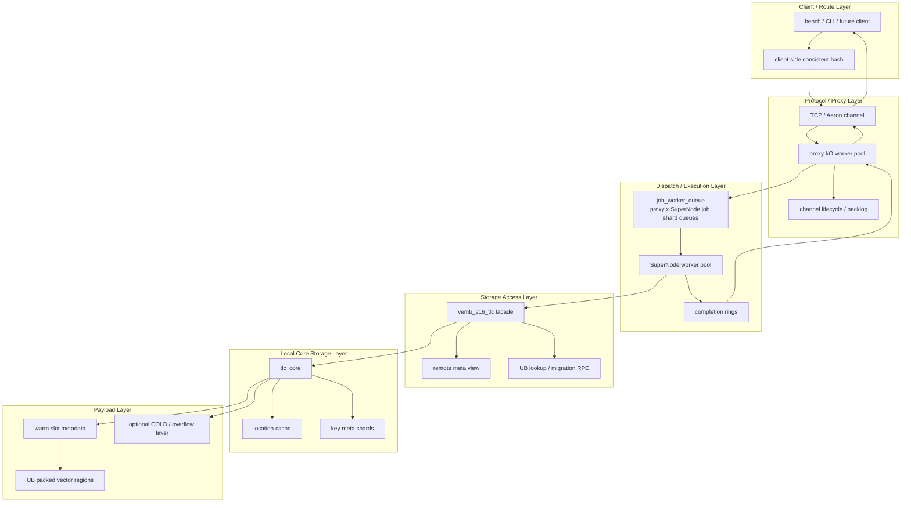
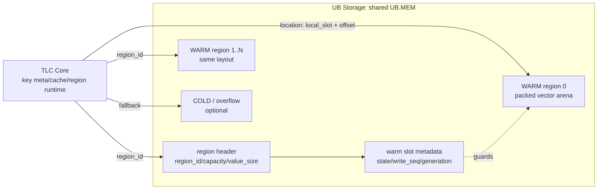
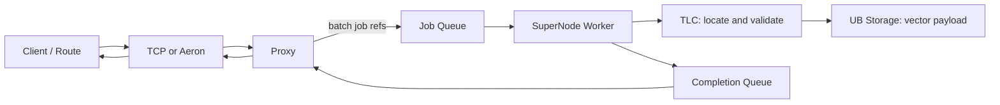
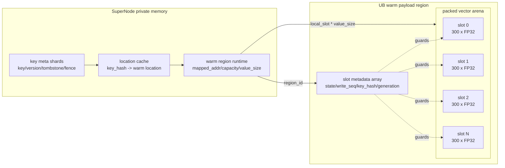

# 基于鲲鹏超节点的 hpc-redis 推荐特征引擎架构设计文档

## 2 简介

### 2.1 目的

本文档用于概述 HPC-Redis Server 在推荐特征向量场景下的架构设计。文档重点说明 HPC-Redis Server 如何从原生 Redis 通用命令路径，演进为面向固定向量读写和相似度计算的专用数据面，并梳理系统分层、模块分解、关键时序、设计约束、关键优化设计与性能收益。

### 2.2 背景
推荐特征服务的主要数据是固定维度的向量，访问模式表现为“读多写少”：系统需要持续读取向量用于召回、排序和相似度计算，同时接收少量更新以保持特征新鲜。与通用键值数据相比，这类负载的数据形态和操作类型相对固定，性能关键不在于支持更多数据类型，而在于以更低的固定开销完成向量的定位、搬运和计算。

原生 Redis 以通用性为优先，单次请求通常要经过文本协议解析、命令分派、对象封装以及主线程执行等环节。这些环节保证了广泛的命令语义和一致性，但会把与向量无关的处理成本重复带入每一次访问，并使并发请求在共享执行面上相互影响。因此，直接沿用通用 Redis 路径难以同时满足推荐场景对高吞吐、低延迟和持续更新的要求。

hpc-redis 的核心思想是将固定向量访问从通用命令路径中分离出来，构建面向向量的专用数据面：客户端先依据键确定负责该数据的节点，请求经 TCP 或 Aeron 传输通道到达 proxy；proxy 完成协议解析和请求汇聚后，以轻量请求引用批量提交给 SuperNode，SuperNode 再批量获取请求，由多个工作线程调用 TLC 访问向量元数据和一致性状态，并通过 UB storage 读取或写入向量内容，完成读、写和相似度计算；执行结果写入 completion queue 后，由 proxy 批量取回并通过原传输通道返回客户端。向量内容按固定长度连续存放，键的版本、位置和有效性等少量信息留在节点本地内存中。这样，常态请求只需完成一次路由、一次本地定位和必要的数据访问，避免在主线程中反复进行通用对象处理。

读请求根据运行环境采用两种交付方式：跨机器访问直接返回完整向量，同机共享内存访问只返回向量位置，由客户端直接读取数据。两者都表达同一个语义，即返回当前有效版本的向量。写入和节点扩展则通过版本推进与访问切换控制，确保数据迁移期间不会返回旧向量，也不会因并行读写丢失更新。由此，hpc-redis 在保持 Redis 易用访问方式的同时，把通用性让位于固定向量场景所需要的并行执行、低数据搬运开销和可扩展性。

## 3 设计约束

### 3.1 遵循标准/协议

- HPC-Redis Server 自定义二进制协议：`VEMB_V16_MAGIC`、`VEMB_V16_VERSION`、固定 frame type 与 data op，定义在 `src/vemb_v16_protocol.h`。
- TCP transport 第一阶段使用 persistent connection + binary frame，支持 `HELLO/WELCOME/REQUEST/RESPONSE/STATS/CLOSE` 等 frame。
- Aeron 路径保留 handle/mmap 语义，TCP 路径下完整向量读取使用 `VEMB_V16_OP_VEMB_INLINE`。
- 多 endpoint 路由使用 client-side consistent hash，virtual node hash 使用 `vemb_v16_murmur3()`。
- 默认向量维度为 300，协议上限为 `VEMB_V16_MAX_DIM`。

### 3.2 限制与约束

本系统将“请求如何到达 Server”和“向量内容如何交付给 CLI”分开约束。所有 HPC-Redis 使用的 UB Region 都是共享数据区域，不是每个进程各自维护的本地副本；参与同一数据面的 Server 组件必须映射相同的 UB Region，并使用一致的 region layout、向量维度和访问参数。TCP 可以跨机器传输完整向量；Aeron 只传递请求和 handle，向量仍保留在 Server 与 CLI 都能访问的共享 UB.MEM 中。因此，Aeron 的低复制能力以共享映射、客户端实现和版本校验共同满足为前提，不能把它当作普通 TCP 连接使用。

**通用架构边界**

- Client / CLI 负责根据 key 选择 owner，并遵循统一的路由规则；Proxy 不维护全局拓扑，不进行二次 hash 或跨节点 fan-out。
- Proxy 只负责连接、协议解析、任务提交和结果返回，不负责 key 版本判断、向量计算或 WARM/COLD 数据访问；这些工作由 SuperNode 和 TLC 完成。
- `location cache` 只缓存 key 到向量位置的小型元数据，不能作为永久有效的 handle。缓存命中后仍必须校验 key 版本、slot 状态、`write_seq` 和 `owner_generation`。
- WARM handle 只能指向 WARM data region。COLD/overflow 中的数据必须先提升到 WARM 并发布为稳定 slot，才能向客户端返回 handle。
- `region_id` 是对外稳定的 WARM region 身份，`region_index` 只是 Server 进程内的数组下标；CLI、协议和迁移信息中不能混用二者。

**Aeron 模式的使用前提**

- CLI 与 HPC-Redis Server 必须处于同机或具备 UB 直连能力的环境，并且双方都能映射同一份 UB WARM region；CLI 不能映射自己的副本，也不能只映射 Aeron ring 而不映射向量所在的 Region。不具备共享映射条件时，必须使用 TCP `VEMB_INLINE`。
- CLI 必须使用 Server 发布的 region 描述建立 Aeron request/response ring 和 WARM region 映射，不能自行猜测 region 路径、映射偏移、容量或向量长度。请求和响应协议版本、向量维度、`value_size` 也必须一致。
- Server 返回的 `VEMB_HANDLE` 是带版本的位置描述，不是永久指针，也不代表 CLI 获得了该 slot 的所有权。CLI 只能按 `region_id`、`local_slot`、`offset` 和 `bytes` 在已映射区域内读取，不能写入、释放或复用 Server 管理的 slot。
- CLI 必须检查 handle 的边界和长度，确认 `offset + bytes` 位于对应 WARM region 内，且 `bytes` 与约定的向量维度一致。`region_id`、`local_slot` 或 `owner_generation` 不匹配时，不能继续解引用。
- CLI 不得长期保存并重复使用旧 handle。Server 重启、region 重新创建、数据删除、覆盖写或迁移后，旧 handle 都可能失效，CLI 必须重新发起 `VEMB_HANDLE` 获取新的位置描述。

**并发访问与结果一致性**

一致性保证建立在“先发布稳定状态，再允许读取”的规则上。Server 写入 payload 时先将 slot 置为写入状态，并将 `write_seq` 变为奇数；向量 bytes 和 slot 元数据全部写完后，再以发布语义将 `write_seq` 更新为偶数并将 slot 置为 `READY`。Server worker、Aeron CLI 和其他共享映射读者都必须在读取前后检查 `write_seq`，只有两次读取相同且均为偶数时才接受结果。

| 场景 | Server 侧处理 | CLI/请求侧行为 | 一致性结果 |
| --- | --- | --- | --- |
| 并发覆盖写 | `write_seq` 进入写入状态，完成后发布新稳定版本 | 读取前后版本不一致时丢弃本次读取并重试 | 不返回半写或混合版本的向量 |
| `location cache` 过期 | 通过 key 版本、slot 状态和 owner 版本拒绝旧位置，并重新定位 | 不把 cache 命中直接当作成功结果 | 不返回已经失效的缓存位置 |
| `VREM` 删除 | 推进 key 版本、写入 tombstone，并使旧 slot/旧位置不可见 | 收到 miss 或重试结果后重新获取状态 | 删除完成后旧 handle 不能继续读出向量 |
| owner 迁移或拓扑切换 | 使用 topology epoch、source fence 和 `owner_generation` 控制旧 owner 与新 owner 的可见范围 | 遇到 redirect、retry 或版本不一致时重新路由并获取 handle | 不在 cutover 或 source 回收期间返回旧 owner 数据 |
| Aeron region 重建 | 使旧 region 身份或 generation 失效，重新发布可用 region 描述 | 重新映射 region 并重新获取 handle | 不解引用已被重建或复用的共享区域 |

因此，TCP `VEMB_INLINE` 的成功结果表示 Server 已复制出一个稳定的完整向量快照；Aeron `VEMB_HANDLE` 的成功结果表示 Server 已发布一个经过校验的稳定位置，CLI 还必须按同一套 slot 状态、`write_seq` 和 `owner_generation` 规则完成实际读取。Aeron handle 描述的是可校验的位置和版本，不是获取时刻的不可变数据副本：如果 CLI 获取 handle 后、真正读取前发生了同一 slot 的覆盖写，CLI 在重新校验通过后会读取该 slot 的最新稳定 payload；如果数据因删除或迁移而转移到新位置，旧 handle 会因版本或 owner 校验失败，CLI 必须重新获取 handle。由此，Aeron CLI 最终接受的是读取校验时的最新有效版本，而不是旧 handle 对应的过期版本。并发更新、删除或迁移发生时，系统通过放弃当前结果并重试来保证不返回错误版本，而不是阻塞所有读写请求。

## 3 第一层设计描述
本章在总体架构的基础上，进一步说明 hpc-redis 单个服务器内部的组件级组织方式。组件图按请求处理方向展开：Transport Layer 提供两种传输模式，一种是基于 TCP 协议的通用路径，另一种是面向高性能场景、基于 UB 的 Aeron 路径；Proxy Layer 负责连接管理、I/O 和请求分派，Queue Layer 通过 `Job Queue` 与 `Completion Queue` 解耦接入和执行，SuperNode worker pool 批量消费请求并调用 TLC/TLC Core 访问键元数据、位置缓存和 UB.MEM 中的向量内容。请求沿队列向下执行，结果经完成队列向上返回 proxy，形成从协议接入、批量调度到存储访问和结果回传的完整闭环。

### 3.1 架构图




- 跨 SuperNode 路由在 client/bench/CLI 侧完成，server 内 proxy 不做二次 hash。
- proxy 负责接入、channel 生命周期、frame parse、job dispatch、completion drain 和 response write。
- SuperNode worker 是真正执行 `VADD/VEMB/VREM/VSIM` 的数据面执行线程。
- TLC 是 SuperNode 的向量存储访问层，不只是传统意义上的三层缓存。
- UB region 只承载 packed vector bytes，metadata、锁、hash table、迁移状态留在 SuperNode 私有内存。

### 3.2 总体结构解释

本节从一次请求的完整生命周期说明各层之间的职责边界。系统将“请求接入、任务调度、向量定位、数据访问和结果返回”拆分为相互协作但相对独立的组件：客户端负责确定数据归属，Transport/Proxy 负责可靠接入，队列负责批量转交，SuperNode 负责执行操作，TLC 负责存储访问与一致性判断，UB.MEM 负责承载固定长度的向量内容。控制信息与向量 payload 分离，跨组件传递轻量引用而不是反复复制完整向量，从而同时缩短常态读路径并保留并行扩展空间。

该结构的基本数据流为：客户端按键选择目标节点，经 TCP 或基于 UB 的 Aeron 通道发送请求；proxy 完成协议解析和轻量校验后，将请求引用批量写入 `Job Queue`；SuperNode worker 批量取出请求，调用 TLC 定位并校验向量，再从 UB.MEM 读取或写入 payload，必要时执行相似度计算；执行结果写入 `Completion Queue`，由 proxy 批量取回并经原 Transport 返回客户端。请求队列承载执行方向的数据流，完成队列承载返回方向的数据流，二者共同隔离网络抖动与存储计算，避免任一层承担不属于自身的职责。

#### 3.2.1 Client / Route

`CLI`、benchmark 和未来 client 负责生成 `VADD/VEMB/VREM/VSIM` 请求，并根据 key 选择负责该数据的 endpoint。单 endpoint 时，客户端直接发送请求；多 endpoint 时，客户端使用一致性哈希将 key 映射到节点，使同一 key 的读写和计算尽量落在同一 owner 上。

路由由客户端完成，server 内 proxy 不进行二次 hash、不维护全局拓扑，也不执行 fan-out。每个 endpoint 只处理自身负责的 key 范围；跨 owner 的查询、相似度计算和迁移修复通过 remote meta、UB lookup 与迁移控制面完成。这样可以把拓扑判断从每个请求的服务端热路径移除，使 SuperNode 专注于本地执行。

该设计的代价是所有客户端必须遵循同一套路由规则，扩容时还需要同步更新路由 epoch。迁移期间，source fence、owner generation、tombstone 和版本信息共同约束旧 owner 与新 owner 的可见范围，宁可触发重试或重路由，也不能返回已经失效的 payload。后续优化重点是降低路由更新和重试的控制面开销，并保持正常请求不进入拓扑判断路径。

#### 3.2.2 Protocol / Operation Semantics
协议层定义 HPC-Redis Server 数据面的四类基本操作。它们描述“对向量做什么”，与 TCP 或 Aeron 所描述的“如何传输”相互独立：客户端先生成一种操作请求，随后由 Transport 承载、Proxy 分派、SuperNode 执行，最后通过 completion 返回状态或结果。

| 指令 | 作用 | 请求内容 | 成功结果 |
| --- | --- | --- | --- |
| `VADD` | 新增或覆盖一个 key 对应的向量 | key + 固定维度 vector payload | status，以及新向量的 handle 元数据 |
| `VEMB` | 按 key 读取向量 | key；返回方式由 transport 决定 | `VEMB_INLINE` 返回完整 vector，或 `VEMB_HANDLE` 返回位置描述 |
| `VREM` | 删除一个 key 对应的向量 | key 和版本/拓扑信息，不携带 vector payload | status，以及删除后的版本或控制信息 |
| `VSIM` | 读取向量并计算相似度 | `VSIM_INLINE` 携带 query vector 和目标 key；`VSIM_KEY_KEY` 携带两个 key | similarity score，以及必要的 status 或 redirect 元数据 |

四类操作分别覆盖推荐特征服务的写入、读取、删除和相似度计算主路径。`VADD` 负责建立或更新 key 到向量位置的映射，`VEMB` 负责向客户端交付向量，`VREM` 负责删除数据并阻断旧位置继续被读取，`VSIM` 将向量读取和计算合并在 SuperNode 内完成，避免客户端先取向量再发起第二次计算请求。

其中，`VEMB_INLINE` 和 `VEMB_HANDLE` 是 `VEMB` 的两种返回语义，而不是两种独立的业务操作：TCP 模式使用 `VEMB_INLINE`，成功响应携带完整的 300 维 FP32 vector；Aeron 模式使用 `VEMB_HANDLE`，响应只携带 `{region_id, offset, bytes, owner_generation}` 等位置和版本信息，由客户端映射 UB.MEM 后读取 payload。类似地，`VSIM_INLINE` 与 `VSIM_KEY_KEY` 表示两种输入形式，前者由请求直接携带 query vector，后者由 SuperNode 根据两个 key 定位向量，必要时通过 remote meta 和 UB lookup 获取远端数据。

所有操作都遵循统一的请求和响应边界：请求首先经过协议字段、长度、操作类型和向量维度校验；执行阶段由 SuperNode 调用 TLC 完成位置定位、版本判断和数据访问；响应通过 `Completion Queue` 返回 status、handle、payload snapshot 或 similarity score。这样，协议操作语义保持稳定，TCP/Aeron 只改变承载方式和 payload 的交付方式。

#### 3.2.3 Protocol / Transport
在操作语义确定后，Transport 负责选择请求和响应的具体承载方式，不改变 `VADD/VEMB/VREM/VSIM` 的业务含义，只改变请求的传输介质和 payload 的交付路径。

TCP 模式面向通用的跨机器访问。客户端通过 TCP 持久连接发送 `VEMB` 请求，proxy 解析后交给 SuperNode；SuperNode 经 TLC 定位并校验向量，从 UB.MEM warm region 读取完整 payload，最后通过 completion queue 返回 proxy。读取成功时使用 `VEMB_INLINE`，TCP response 同时携带响应状态、必要的 metadata 和完整的 300 维 FP32 向量，客户端收到 response 即获得可直接使用的全量数据。由于 TCP 对端通常不能直接访问服务端的 UB.MEM 地址，因此 TCP 的完整向量读取不能用只返回位置的 handle 代替。

Aeron 模式面向同机或具备 UB 直连条件的高性能场景。客户端通过基于 UB 的 Aeron ring 发送请求，proxy 和 SuperNode 的执行过程与 TCP 模式保持一致，但 SuperNode 完成读取后使用 `VEMB_HANDLE` 返回 `{region_id, offset, bytes, owner_generation}` 等位置和版本信息，不将完整向量复制到 response ring。客户端根据 handle 映射对应的 UB.MEM warm region，再按 offset 直接读取 payload；因此，response 只传递小型控制信息，向量内容留在共享的 UB.MEM 区域中，适合追求高吞吐和低数据搬运开销的场景。

两种模式的共同点是：请求都经过统一的 HPC-Redis Server 编解码、proxy 分派、SuperNode 执行和 completion 返回流程，TLC 都负责向量位置和版本有效性判断。区别在于数据交付边界：TCP 的 `VEMB_INLINE` 将全量 payload 交付给客户端，适合跨机器访问；Aeron 的 `VEMB_HANDLE` 只交付可校验的位置，客户端通过 UB.MEM 共享映射取得 payload，适合高性能本机访问。Transport 还负责连接或 ring 的建立、背压、批量读写和异常关闭，不能把这些状态管理下沉到 SuperNode。

| 对比项 | TCP 模式 | Aeron 模式 |
| --- | --- | --- |
| 主要场景 | 通用跨机器访问 | 同机或 UB 直连的高性能访问 |
| VEMB 返回模式 | `VEMB_INLINE` | `VEMB_HANDLE` |
| response 内容 | 状态、metadata 和完整 300 维向量 | 状态、`region_id/offset/bytes/owner_generation` 等 handle |
| payload 获取 | 客户端从 TCP response 直接获得 | 客户端 mmap UB.MEM warm region 后按 handle 读取 |
| 主要代价 | 网络回传和约 `1200B` payload 拷贝 | 需要共享映射和 handle 有效性校验 |

后续优化将围绕 TCP 的持久连接、批量 encode/decode、pipeline，以及 Aeron 的 ring poll、批量发布和 handle 读取展开；性能评估时必须分别注明两种返回语义，不能将 TCP 全量向量交付能力与 Aeron handle 吞吐直接视为同一指标。

#### 3.2.4 Proxy

Proxy 位于 Transport 与 SuperNode 之间，是外部通信状态与内部执行状态的边界层。它不决定 key 的 owner，也不参与向量存储和计算，只负责把 TCP/Aeron 上的协议请求转换为可调度的内部任务，并把 SuperNode 产生的完成结果转换回对应 Transport 的响应。这样，连接数量、网络事件和慢客户端不会直接进入向量执行和 TLC 控制面。

请求进入时，proxy I/O worker 从 TCP socket 或 Aeron ring 批量读取 frame，完成 magic、version、长度、操作类型和基本请求形状等协议级校验，维护 channel 生命周期，并将完整请求写入 job pool slot。随后，proxy 只向对应的 `Job Queue` 发布轻量 `job_ref`，不在 I/O 线程中调用 TLC、不读取 UB.MEM，也不执行 `VADD/VEMB/VSIM` 的实际操作。请求的版本裁决、slot 状态检查和完整操作语义由 SuperNode/TLC 负责。

结果返回时，proxy 从 `Completion Queue` 批量取出执行结果，根据 `req_id` 和 channel 关联原请求，按 Transport 选择响应格式：TCP `VEMB_INLINE` 需要写回完整 payload snapshot，Aeron `VEMB_HANDLE` 只需写回位置和版本描述。proxy 负责 response encode、批量发布和 socket/ring 写回；对于暂时不可写的 channel，结果保存在对应 backlog 中，并通过回压限制继续接收的请求，避免慢客户端耗尽全局执行资源。

Proxy 的职责边界可以概括为“搬运和调度，不做数据裁决”：它拥有 channel、I/O worker、job 发布、completion 回收和 response backlog；SuperNode 拥有任务执行，TLC 拥有向量定位与一致性，UB.MEM 拥有 payload 存储。后续优化主要包括 I/O worker 与 SuperNode worker 的池化解耦、epoll/ring poll 批量事件处理、request/job/completion/response 的端到端 batch、per-channel 回压，以及减少 inline snapshot 在 backlog 和 response 路径上的重复复制。

#### 3.2.5 Job Queue

`Job Queue` 是 Proxy 到 SuperNode 的请求调度边界，负责把已经完成协议解析的请求交给合适的 SuperNode worker。队列按 `proxy_worker x supernode_worker` 划分 shard，使不同 worker 之间可以并行消费，同时避免所有请求争用一条全局队列。它只负责传递可调度的请求引用，不负责向量定位、payload 存储或业务语义判断。

Proxy 收到请求后，将完整内容写入预分配的 `job pool` slot。slot 保存操作类型、key、hash、flags、topology epoch、req_id 以及必要的 vector payload；队列中只发布轻量 `job_ref`，由 proxy worker、pool type、slot id、generation、req_id 和 op 等字段组成。SuperNode worker 批量取得 `job_ref` 后，根据 slot id 和 generation 找回完整请求，再调用 TLC 执行。这样，约 `1200B` 的 vector payload 不需要在多个 worker 队列之间重复复制，slot generation 也能防止请求完成后旧引用访问已经复用的 slot。

`Job Queue` 的处理方向是 `Proxy -> SuperNode`：Proxy 批量发布请求引用，SuperNode 批量取出并执行。批量化将每条请求的队列发布和消费固定成本摊薄，同时使 worker 可以连续处理同一批请求，减少线程切换和跨核同步。队列容量耗尽时，Proxy 需要根据队列状态暂停或放慢请求接收，避免无界积压扩大内存和延迟。

后续优化将集中在 request/job_ref 的 batch poll/publish、job pool 复用、queue shard 的负载均衡、slot generation 生命周期管理，以及进一步减少大对象跨线程复制。

#### 3.2.6 Completion Queue

`Completion Queue` 是 SuperNode 到 Proxy 的结果回传边界，与 `Job Queue` 方向相反。SuperNode worker 完成 TLC 访问或相似度计算后，将执行结果写入对应的 completion；completion 至少包含 status、req_id 和操作结果，并可按操作携带 handle、完整 payload snapshot、similarity score、redirect 或 retry 信息。队列本身不负责生成客户端 response，只负责安全、有序地把执行结果交给 Proxy。

Completion 通过 `req_id` 关联原始请求，通过 channel 信息确定返回连接。Proxy 批量取出 completion 后，按照 Transport 选择最终格式：TCP `VEMB_INLINE` 将完整 payload snapshot 编码到 response，Aeron `VEMB_HANDLE` 只编码位置和版本信息；随后 Proxy 再按 channel 写回客户端。对于暂时不可写的 channel，completion 或已编码 response 保存在对应 backlog 中，并通过回压限制新的请求进入，避免慢客户端阻塞其他 channel 和 SuperNode worker。

`Completion Queue` 的处理方向是 `SuperNode -> Proxy`：SuperNode 只发布已经完成的结果，Proxy 负责关联请求、编码响应和传输回写。它把执行线程与网络回写解耦，使 SuperNode 不需要等待 socket 可写，也使同一批完成结果可以被 Proxy 一次性处理。后续优化重点是 completion 的批量发布与批量取回、不同响应类型的内存复用、TCP inline snapshot 的复制次数、Aeron handle 的轻量化，以及 queue 满载时的回压和丢弃策略。

#### 3.2.7 Worker / SuperNode

Worker / SuperNode 是 HPC-Redis Server 的实际执行层，负责把 `Job Queue` 中的请求转换为向量存储操作或相似度结果。worker pool 按 queue shard 批量取出 `job_ref`，恢复 job pool 中的完整请求后，先完成操作类型、key、向量维度和 payload 大小等必要校验，再按照操作类型调用 TLC。执行完成后，worker 将 status、handle、payload snapshot 或 similarity score 写入 `Completion Queue`，不直接操作客户端连接。

四类操作在该层的执行职责不同：

- `VADD`：将输入的固定维度向量交给 TLC，由 TLC 完成版本判断、slot 选择或复用、metadata 更新以及向 UB.MEM 写入 payload。
- `VREM`：按 key 删除向量，推进版本和 tombstone 状态，阻断旧 location 继续被读出；该操作不携带 vector payload。
- `VEMB`：按 key 获取稳定的向量位置。TCP `VEMB_INLINE` 需要从 UB.MEM 复制完整 payload snapshot，Aeron `VEMB_HANDLE` 只返回经过校验的 handle。
- `VSIM`：在 SuperNode 内完成向量读取和相似度计算。`VSIM_INLINE` 使用请求携带的 query vector，`VSIM_KEY_KEY` 根据两个 key 定位向量，必要时通过 TLC 获取远端 handle 或 snapshot。

一次任务的执行顺序可以概括为“批量取任务、校验请求、调用 TLC、访问 payload、执行计算、发布 completion”。TLC 负责位置解析、版本有效性和读写一致性，UB.MEM 负责固定长度 vector bytes，SuperNode worker 负责操作编排和 SVE 向量计算。SuperNode 不负责客户端连接、Transport 状态或全局拓扑选择，因此网络回压和路由切换不会改变本地执行语义。

该层的后续优化主要包括 worker 数量与 queue shard 的匹配、任务和 completion 的批量执行、worker 与数据分片的局部性、固定维度下的 SVE load/copy/cosine，以及将 payload 搬运、slot 校验和相似度计算安排在同一执行批次中，减少线程回流、重复定位和中间数据复制。

#### 3.2.8 Storage Access / TLC

TLC（Storage Access Layer）是 SuperNode 的统一向量访问入口和一致性协调层，不只是负责数据淘汰的传统缓存。它向上为 `VADD/VREM/VEMB/VSIM` 提供统一接口，向下连接本地 metadata、key meta shard、location cache、UB.MEM payload、远端 metadata view、UB lookup RPC 和迁移控制面。SuperNode 只描述要执行的操作，TLC 负责回答“向量在哪里、当前版本是否有效、是否可以读写以及是否需要访问远端”。

对本地 key，TLC 首先通过 location cache 快速找到向量位置，再校验 warm slot 是否为 `READY`、`write_seq` 是否稳定以及 `owner_generation` 是否匹配。校验通过后，TLC 可以返回一个小型 handle，或复制出稳定的 payload snapshot；校验失败时才进入对应的 key meta shard 重新裁决。key meta shard 按 key hash 将控制信息分片，同一 shard 内的写入、删除、版本推进、tombstone、迁移 fence 和 location cache 更新按顺序完成，不同 shard 之间则可以并行执行。这样，读请求的大多数 cache 命中路径不需要获取 shard 锁，只有 cache miss 或一致性状态不明确时才进入控制面。

写入和删除由 TLC 先根据 key hash 定位到 key meta shard，在 shard 的细粒度控制边界内完成版本判断、slot 选择或复用及删除状态更新，再协调 warm slot 的 payload 写入和最终版本发布。

handle 只描述向量的位置和版本，不包含完整 Redis object 或 vector bytes。其主要字段为 `region_id/local_slot/offset/bytes/owner_generation`：`region_id` 表示稳定的 warm region 身份，`local_slot` 表示该区域中的槽位，`offset/bytes` 描述 payload 的位置和长度，`owner_generation` 用于判断该位置是否仍属于当前 owner。`region_id` 与本地运行时数组中的 `region_index` 是不同概念，不能混用。若向量只存在于 COLD/overflow 层，TLC 需要先将其提升到 WARM，再向上层返回 WARM handle。

`VSIM_KEY_KEY` 表示根据两个 key 找到对应向量并计算相似度。当两个 key 由不同的 SuperNode 负责时，TLC 先确认第二个 key 当前由哪个节点负责，以及该节点上的向量位置和版本是否仍然有效；这一步只读取少量的位置和版本信息，代码中称为 `remote meta`。确认远端数据有效后，系统才通过 `UB lookup` 获取向量位置或稳定的数据快照，交给 SuperNode 完成计算。若发现数据正在迁移或版本已经变化（例如 `key_version`、`owner_generation` 或 `topology_epoch` 与请求或远端记录不一致），系统返回重试或重路由结果，而不是继续使用旧向量。普通的本地读写不经过这条远程路径，因此不会承担额外的远程访问开销。

TLC 的职责边界是“定位、校验和协调”，SuperNode 负责操作编排与计算，UB.MEM 负责保存固定长度的 payload，Proxy 负责协议和网络返回。后续优化主要包括 location cache 的本地命中、metadata 与 payload 分离、key meta 分片锁、slot bitmap/seqlock、单 owner 快路径跳过 remote-meta publish，以及多 owner 场景按目标 view 异步发布，从而把远程控制和迁移开销限制在必要请求上。

#### 3.2.9 UB Storage

UB Storage 位于 TLC Core 之下，是向量 payload 的共享存储后端，不负责 key 查找、版本裁决或迁移决策。TLC Core 保存 key meta shard、location cache 和 warm region runtime，并向 UB Storage 提供 `region_id`、`local_slot` 和 `offset`；UB Storage 根据这些位置描述访问对应的共享 WARM region。两层的边界是：TLC Core 决定“访问哪个 slot、这个 slot 是否有效”，UB Storage 负责“保存 slot 状态和向量 bytes，并提供可并发访问的内存布局”。

每个共享 WARM region 按固定布局组织为 `[region header][slot metadata array][packed vector arena]`。region header 描述 `region_id`、容量和向量长度；slot metadata 保存 `state`、`write_seq`、`owner_generation`、`bytes` 等与该 slot 对应的状态；packed vector arena 只保存固定长度的 FP32 vector bytes。默认每条向量为 `300 * 4 = 1200B`，`local_slot * value_size` 可以直接计算 payload 偏移，避免 Redis object 和变长对象的寻址开销。COLD/overflow 是可选的上层容量补充，不改变 WARM region 的基本布局。

UB Storage 的逻辑布局如下：



图中仅展开 `WARM region 0` 的一条完整路径，`WARM region 1..N` 复用相同布局。图中的 `TLC Core -> UB Storage` 是位置访问关系，不是网络或 RPC 通道：TLC Core 先根据 key 找到 `region_id` 和 `local_slot`，再计算该向量在 WARM region 中的字节位置 `offset = local_slot * value_size`，将这些位置描述交给 UB Storage。UB Storage 通过共享 slot metadata 校验状态，并按 `offset` 访问 vector bytes。key version、tombstone、迁移 fence 和 location cache 不属于 UB Storage，而由 TLC Core 在私有内存中维护。

#### UB region 的粒度、分桶与冲突处理

UB region 是向量存储的基本分配单位，但 key 不会直接把 hash 转换成一个唯一的字节地址。系统先按固定向量大小计算一个 region 能容纳的 slot 数：`capacity_slots = region_bytes / value_size`。以 300 维 FP32 为例，每个 slot 固定保存 `1200B` payload；一个 `1GiB` 的 payload 区域约可容纳 `1GiB / 1200B` 个 slot，slot metadata 与 payload 一一对应。因此，region 的粒度是“若干个固定大小 slot 的共享区域”，而不是一个 key 一个独立内存块。

key 到 region 的选择分为两步。第一步，TLC 将每个 region 按配置的容量权重放置多个虚拟位置；本地 region 会获得额外权重，通常优先承载本地数据。key hash 在这些虚拟位置上找到一个起点，系统从该起点依次尝试候选 region。这样，增加或减少 region 时只会影响部分 key，且容量较大的 region 可以通过更高权重获得更多 key，而不需要维护一张逐 key 的固定映射表。

第二步，key 进入某个 region 后，系统不会扫描整个 region，而是将 slot 按每组最多 8 个 slot 划分为多个小集合。经过混合的 key hash 计算出集合编号：

```text
set_count = ceil(capacity_slots / 8)
set_id    = mix(key_hash) % set_count
候选 slot  = set_id 对应的最多 8 个 slot
```

因此，一个 key 的正常访问范围只是一个小集合，而不是整个 region。这个“小集合”就是这里所说的桶；`region` 是共享内存的大容器，`bucket/set` 是容器中的候选 slot 集合，`local_slot` 才是最终存放向量的具体位置。读请求按同样的规则找到候选集合，再在集合内确认具体 slot。

Hash 只用于缩小搜索范围，不能被当作唯一身份。写入或读取每个候选 slot 时，系统同时检查 `key_hash` 和 key fingerprint，并结合 slot 状态确认是否是同一个 key；因此，即使两个不同 key 被映射到同一个 hash 或同一个桶，也不会把一个 key 的向量误认为另一个 key。相同 key 的覆盖写直接复用原 slot，并通过 `write_seq` 保证读者不会看到半写内容。

当一个桶中的 8 个 slot 都被其他 key 占用时，系统不会覆盖其中任何一个 slot，而是继续尝试 hash 环上后续的候选 region；如果候选 region 都没有可用 slot，再由 TLC 按配置进入 COLD/overflow 等后备路径或报告容量不足。这个处理方式把“hash 冲突”和“region 容量耗尽”区分开：前者通过桶内多 slot、key 身份校验和后续 region 解决，后者通过 region fallback 或上层容量策略解决。整个过程只由 TLC 决定位置，UB Storage 负责按最终 `region_id + local_slot` 保存和并发读写 payload。

HPC-Redis Server 的基本存储对象不是 Redis object，而是由控制区 metadata 指向的固定长度 payload：

```text
key_hash = murmur3(vector_key)
location = {region_id, region_index, local_slot, offset, bytes, owner_generation}
payload = mapped_addr + offset
```

Handle 的寻址基准是“对应 WARM region 的逻辑 payload 映射基址”，不是某个进程的绝对虚拟地址，也不是 UB 设备或文件的绝对地址。Server 和 CLI 虽然可能被操作系统映射到不同的虚拟地址，但它们都使用同一个 `region_id` 找到同一份共享 region，再用 handle 中的相对 `offset` 找到 payload：

```text
Server:  payload_ptr = server_region.mapped_addr + handle.offset
CLI:     payload_ptr = cli_region.mapped_addr    + handle.offset
```

这里的 `mapped_addr` 是逻辑 payload 区域的起始地址。对于 UB WARM region，物理布局仍是 `[region header][slot metadata][payload arena]`；Server 和 CLI 建立映射时，映射描述中的 `mmap_offset` 已经指向这份 region 的逻辑起点，代码再通过页对齐和内部布局调整得到 `mapped_addr`。因此，handle 的 `offset` 不需要包含 header 或 slot metadata 的长度，也不能直接加到原始 `mmap()` 返回的未调整地址上。

`region_id` 用来选择哪一个已映射 region，`local_slot` 用来定位并校验该 region 中的 slot metadata，`offset` 用来定位 payload，`bytes` 用来做边界检查，`owner_generation` 用来确认该 slot 仍属于有效版本。TLC Core 会校验 `local_slot < capacity_slots`、`offset == local_slot * value_size` 和 `bytes == value_size`；校验通过后，Server 才读取或写入 `mapped_addr + offset`。Aeron CLI 收到 handle 后执行同样的 region 查找、边界检查和 slot 版本校验，随后从自己的 `mapped_addr + offset` 读取同一份共享 payload。`mmap_offset` 只参与“把哪一段 UB 区域映射进进程”，`offset` 才是 handle 相对于逻辑 payload 基址的字节偏移。

读路径和写路径的 key 级裁决由 TLC Core 完成；进入 UB Storage 后，TCP `VEMB_INLINE` 读取稳定的 payload snapshot，Aeron `VEMB_HANDLE` 返回已经校验过的 slot 位置。UB Storage 不修改 key version、tombstone 或 location cache，只按 TLC Core 提供的位置读写共享 region。

UB Storage 的并发安全只覆盖共享 region 内的 slot 和 payload。slot metadata 中的 `state`、`write_seq` 和 `owner_generation` 使用共享原子字段：写线程先通过 CAS 取得 slot，将 `write_seq` 从偶数切换为奇数表示正在写入，完成 vector bytes 和其他 metadata 更新后，再以发布语义写回新的偶数稳定版本并将 slot 设为 `READY`；读线程以获取语义读取 slot 状态，在复制 payload 前后各读取一次 `write_seq`，只有两次值相同且均为偶数、slot 为 `READY` 时才接受结果，否则重试。这样，多个 worker 或进程可以安全访问同一映射区域，读者不会看到半写 payload。key 级写入顺序、迁移 fence 和 owner 版本由 TLC Core 保证。后续 UB Storage 优化主要包括共享 region 的固定布局、slot metadata 的原子访问、payload 批量访问、固定 stride、prefetch、region 容量和 fallback；cache、分片锁和迁移控制属于 TLC Core 的优化范围。

在 Aeron 模式下，CLI 读取 `VEMB_HANDLE` 指向的数据也遵循同一并发安全规则。CLI 收到 `region_id`、`local_slot`、`offset`、`bytes` 和 `owner_generation` 后，先在已映射的 UB.MEM WARM region 中定位对应 slot，再读取共享 slot metadata 并在 payload 读取前后校验 `state`、偶数且未变化的 `write_seq` 以及匹配的 `owner_generation`。只有校验通过，CLI 才接受本次向量读取；如果发现 slot 正在写入、版本发生变化或位置已失效，则丢弃当前结果并重新获取 handle。由此，Aeron 的低复制读取并不牺牲并发一致性，服务端 worker、SuperNode 与 CLI 共享同一套发布、校验和重试机制，避免 CLI 读到半写或已失效的向量。

#### 3.2.10 组件职责与后续优化重点

本节从评审视角概括各组件的边界以及后续优化的目标。系统并不是把所有工作集中到一个执行线程，而是将一次向量请求拆成四类职责：客户端确定请求应到达的节点；Transport 和 Proxy 负责接入与返回；队列负责把接入和执行解耦；SuperNode、TLC 和 UB Storage 负责执行操作、判断数据是否有效以及访问向量内容。这样的划分使网络波动不会直接阻塞向量执行，也使大尺寸向量不必在每个组件之间重复复制。

| 层次/组件 | 主要职责 | 这样划分解决的问题 | 后续优化重点 |
| --- | --- | --- | --- |
| Client / Route | 根据 key 选择负责该数据的节点，并生成 `VADD/VEMB/VREM/VSIM` 请求。 | 让同一 key 的读写尽量到达同一个负责节点，Proxy 不需要再次判断拓扑或向多个节点转发。 | 优化路由表更新、扩容期间的重试和重路由，降低迁移对正常请求的影响。 |
| Transport | 通过 TCP 或基于 UB 的 Aeron 传递请求和响应。TCP 返回完整向量，Aeron 返回 handle，由客户端从共享区域读取向量。 | 统一业务操作的含义，同时根据跨机器和高性能本机场景选择不同的数据交付方式。 | 优化持久连接、批量收发、流水线和回压；分别评估 TCP 的完整向量吞吐与 Aeron 的 handle 读取吞吐。 |
| Proxy | 读取协议请求、完成基本校验、建立任务、管理连接，并把执行结果写回原连接或 ring。 | 将连接数量、协议解析、慢客户端和网络事件隔离在接入层，避免它们进入 TLC 和向量计算路径。 | 优化 I/O worker 数量、请求解析和响应写回，减少数据复制，并通过批量处理和回压避免队列堆积。 |
| Job Queue | 以轻量请求引用把 Proxy 接收的任务交给 SuperNode worker；完整任务内容保存在可复用的任务存储区。 | 使 Proxy 不必等待任务执行，也避免把约 `1200B` 的向量在跨线程队列中反复搬运。 | 优化任务存储区复用、引用生命周期校验、队列分片和批量提交/获取，减少分配、释放和线程唤醒。 |
| SuperNode Worker | 批量执行四类向量操作，调用 TLC 定位和校验数据，并完成向量读写或相似度计算。 | 将真正消耗 CPU 和内存带宽的工作集中到可并行扩展的执行线程，而不是 Redis 通用主线程。 | 优化 Proxy/worker 配比、批量执行、任务亲和性，以及 SVE 向量计算与数据读取的协同。 |
| Completion Queue | 保存 SuperNode 的状态、handle、向量快照或相似度结果，供 Proxy 批量取回。 | 将执行完成与网络返回再次解耦，SuperNode 不需要直接处理连接和发送阻塞。 | 优化完成项复用、批量取回与响应聚合、异常结果处理和回压，减少完成结果跨层传递的固定成本。 |
| TLC（含 TLC Core） | 根据 key 找到向量位置，维护 key 的版本、删除状态和迁移状态，并确认返回的位置仍然有效；跨节点时才访问远端控制信息。 | 将“这个 key 当前对应哪个有效版本”与“向量内容存放在哪里”统一裁决，避免返回已删除、正在迁移或已过期的数据。 | 优化位置缓存命中、按 key 分片的控制锁、读侧版本校验，以及把远端查询限制在跨节点和迁移场景。 |
| UB Storage | 在共享 WARM region 中保存 slot 状态和固定长度向量 payload，并用原子状态和 `write_seq` 协调并发读写。 | 让服务端 worker 和 Aeron CLI 可以访问同一份向量内容，同时避免读者看到写入中的半个向量。 | 优化固定布局、slot 原子操作、批量读取、预取、区域容量管理和 COLD/overflow fallback；不把 key 版本和迁移控制下沉到这一层。 |

后续优化按以下顺序推进。第一，先降低每个请求必经的固定成本：通过请求和完成结果的批量处理、任务存储区复用以及轻量引用传递，减少对象分配、跨线程复制和频繁唤醒。第二，缩短读多写少场景的热路径：优先使用位置缓存，使用共享 slot 状态和 `write_seq` 判断数据是否稳定，仅在缓存失效、版本不一致或迁移期间进入更重的控制路径；TCP 复制完整向量，Aeron 直接读取共享向量。第三，提升并发和扩展能力：增加 key 元数据分片、调整 worker 与队列的对应关系，并将远端元数据查询和迁移处理限制在确有需要的请求上。

这些优化存在明确的依赖关系：只有接入层能够形成足够大的批次，执行层才有稳定的并行度；只有任务通过轻量引用传递，批量化才不会被大向量复制抵消；只有 TLC 的控制信息与 UB Storage 的 payload 分离，位置缓存、细粒度锁和 `write_seq` 才能分别服务于不同的并发路径。因此，第 4 章将分别验证各项优化对端到端吞吐、尾延迟、单位 CPU 吞吐、队列积压、缓存命中率、读侧重试次数和数据一致性的影响，其中一致性校验必须保证不存在半写向量和失效 handle。

### 3.3 基本策略

1. 热路径专用化：固定向量 workload 走 HPC-Redis Server request/response 语义，避免 Redis 通用命令框架。
2. 接入与执行分离：proxy I/O worker 处理网络/环队列，SuperNode worker 处理存储和计算。
3. metadata 与 payload 分离：key 级 metadata 保留在 SuperNode 私有内存，UB WARM region 共享 slot metadata 与 packed vector bytes。
4. 读路径无锁化：location cache + warm slot state/write_seq/owner_generation 组合校验。
5. 写路径细粒度串行：key meta shard lock 串行化同 shard 控制面，slot CAS/seqlock 保护 payload。
6. 返回语义分流：Aeron 返回 handle，TCP inline 返回 payload snapshot。
7. scale-out 前置路由：client 侧 consistent hash 决定 endpoint，proxy 不做拓扑 fan-out。

### 3.4 业务链路

本节只描述请求和数据的主要流向。所有操作都遵循同一条执行路径：客户端根据 key 选择节点，经 TCP 或 Aeron 将请求交给 Proxy；Proxy 完成协议校验后批量提交任务引用，SuperNode worker 批量取出任务并调用 TLC；TLC 先查询 `location cache` 快速获得候选位置，再判断 key 的有效版本和向量位置，UB Storage 负责读写向量内容；执行结果进入 Completion Queue，再由 Proxy 批量取回并通过原 Transport 返回客户端。



这条路径有四个共同设计：请求在队列之间传递轻量引用，避免完整向量重复复制；请求和完成结果都按批处理，摊薄调度和唤醒开销；`location cache` 只保存 key 到 `{region_id, local_slot, offset, bytes, owner_generation}` 的位置元数据，不保存完整向量；key 的版本与位置由 TLC 判断，向量 payload 由 UB Storage 保存，网络层不参与存储一致性裁决。缓存命中只表示“可以快速尝试这个位置”，仍需校验 slot 状态、`write_seq` 和 owner 版本；缓存未命中或校验失败时，再进入 TLC 的完整控制路径。

#### 3.4.1 `VADD` 写入

客户端发送 key 和完整向量。Proxy 将请求放入任务池并批量提交引用；SuperNode 交给 TLC 处理 key 版本、slot 选择和写入顺序。UB Storage 先将 slot 标记为写入中，再写入向量，完成后发布为可读版本；TLC 随后更新 key 的位置和版本信息，并写入或更新 `location cache`。Completion 只返回状态和新 handle，不回传完整向量。

核心设计是将“key 是否更新成功”和“向量 bytes 是否写完整”分开保护：TLC 负责 key 级顺序，UB Storage 通过 slot 状态和 `write_seq` 保护 payload，只有两者都完成后新位置才对读请求可见。

#### 3.4.2 `VEMB` 完整读取

TCP 使用 `VEMB_INLINE`。客户端只发送 key，SuperNode 通过 TLC 先查询 `location cache`，命中后直接获得候选位置；缓存未命中或候选位置失效时，再从 key 元数据中重新定位。确认稳定位置后，UB Storage 读取向量。读取前后检查 slot 的 `write_seq`，确认期间没有写入后，将完整向量放入 Completion Queue；Proxy 再通过 TCP 返回给客户端。

核心设计是返回稳定的 payload snapshot：TCP 客户端收到响应时已经拿到完整向量，不需要理解服务端内存布局；并发写入发生时，本次读取重试，不返回半写数据。

#### 3.4.3 `VEMB` handle 读取

Aeron 使用 `VEMB_HANDLE`。客户端只发送 key，SuperNode 通过 TLC 查询并校验 `location cache` 中的候选位置；缓存未命中、版本不一致或正在迁移时，TLC 回到 key 元数据控制路径重新判断。校验通过后，Completion 只返回 `region_id`、`local_slot`、`offset`、`bytes` 和 `owner_generation` 等小型 handle。客户端根据 handle 映射 UB.MEM 并读取向量，读取过程继续使用 slot 状态、`write_seq` 和 owner 版本进行校验。

核心设计是控制信息与向量内容分离：handle 通过 Aeron ring 传递，向量仍留在共享 UB Storage 中，避免约 `1200B` 的 payload 在响应路径中重复搬运；并发安全由服务端和客户端共同遵循同一套发布、校验和重试规则保证。

#### 3.4.4 `VREM` 删除

客户端发送 key。SuperNode 通过 TLC 在对应 key 控制范围内推进版本并写入删除标记，同时删除或标记失效的 `location cache` 条目和旧位置；后续读请求即使命中旧缓存，也必须经过版本、slot 状态和 owner 校验，不能继续返回旧向量。删除完成后，Completion 返回状态，旧 slot 由存储层在确认不再被引用后回收或复用。

核心设计是先阻断旧位置的可见性，再回收向量空间。删除不会直接依赖物理清零 payload，而是依靠 key 版本、删除标记和 slot 有效性共同保证语义正确。

#### 3.4.5 `VSIM` 相似度计算

`VSIM_INLINE` 请求携带 query vector 和目标 key；`VSIM_KEY_KEY` 请求携带两个 key。Proxy 将请求批量交给 SuperNode，SuperNode 通过 TLC 查询目标 key 的 `location cache`，必要时回到 key 元数据路径确认位置和版本，再从 UB Storage 读取稳定 payload，并在本地完成相似度计算，Completion 只返回 score 和状态。

当 `VSIM_KEY_KEY` 的两个 key 属于不同节点时，TLC 先确认远端 key 的 owner、版本和位置，再通过远端查询获得 handle 或稳定数据快照。若发现迁移或版本变化，当前计算结果作废并重试或重路由，不使用旧向量。

核心设计是把“向量读取 + 相似度计算”合并在 SuperNode 内，避免客户端先取回向量、再发起第二次计算请求；跨 owner 只增加必要的控制信息查询，普通本地请求仍走本地快速路径。

## 4 优化设计

hpc-redis 的优化目标不是在 Redis 原有命令路径上做局部加速，而是围绕推荐特征向量的固定访问形态重构数据面。读写对象、协议、线程模型、存储布局和返回语义都服务于同一个目标：让 CPU 时间尽量用于 key 定位、payload 搬运和向量计算，避免消耗在通用对象模型、通用命令调度和跨线程唤醒上。

### 4.1 基础设计: HPC-Redis Server 独立数据面

HPC-Redis Server 独立数据面的目标，是为固定维度向量建立一条专用的请求、执行和返回路径。它的核心差异不在于“返回二进制数据”，而在于向量请求不再经过 Redis 通用命令路径中的文本解析、命令查找、通用对象创建和主线程执行。`VADD/VEMB/VREM/VSIM` 直接使用固定格式的二进制请求和响应，进入 Proxy、Job Queue、SuperNode、TLC 和 UB Storage 组成的专用数据面。

一次请求的基本流向如下：

```text
Client / CLI
    -> TCP or Aeron
    -> Proxy: 协议校验与请求接入
    -> Job Queue: 批量传递轻量任务引用
    -> SuperNode Worker: 执行向量操作
    -> TLC: 定位并校验 key 的有效版本
    -> UB Storage: 读取或写入固定长度向量
    -> Completion Queue
    -> Proxy
    -> TCP response or Aeron handle
```

该数据面包含四个相互配合的基本设计。

1. **操作路径专用化。** 请求只携带固定向量操作所需的字段，Proxy 完成格式和长度校验后直接创建可调度任务，不创建 Redis 通用对象，也不进入通用命令表。这样，CPU 时间更多用于 key 定位、payload 访问和相似度计算。
2. **接入与执行分离。** Proxy 只处理 socket/ring、连接状态、任务提交和结果返回；SuperNode worker 只处理向量读写、删除和相似度计算。网络抖动、慢客户端和连接数量不会直接阻塞存储与计算。
3. **控制信息与向量内容分离。** TLC 保存 key 的版本、删除和迁移状态，并通过 `location cache` 快速定位向量；UB Storage 保存共享 WARM region 中的 slot metadata 和固定长度 payload。队列之间优先传递轻量引用，避免约 `1200B` 向量被重复复制。
4. **返回方式按传输环境区分。** TCP `VEMB_INLINE` 在响应中返回稳定的完整向量，适用于跨机器访问；Aeron `VEMB_HANDLE` 只返回带位置和版本信息的 handle，由 CLI 映射相同的 UB Region 后读取 payload。两种方式的业务语义相同，差别只在向量内容的交付位置。

独立数据面因此同时解决三个问题：绕开通用 Redis 路径带来的固定处理开销；通过 Job Queue、Completion Queue 和 worker pool 形成可批量、可并行的执行链路；通过 TLC 的版本判断与 UB Storage 的 slot 并发控制，保证向量在读写、删除和迁移期间不会以半写或失效版本对外可见。后续 `4.2` 至 `4.10` 的优化，分别围绕接入与执行解耦、批量调度、位置缓存、细粒度并发控制、SVE 计算和 TCP/Aeron 返回语义展开，而不是改变这条基础数据流。

### 4.2 优化：proxy I/O 与 SuperNode 执行解耦

本节优化的是请求接入和向量执行之间的边界。系统使用两类线程：Proxy I/O worker 负责读取 TCP/Aeron、解析请求、提交任务、批量取回执行结果和处理响应积压；SuperNode worker 负责调用 TLC、访问 UB Storage、执行写入/删除和相似度计算。Proxy 不直接访问向量，也不等待某个请求执行完成。

一次请求在两类线程之间按以下方式流动：

```text
Proxy I/O worker
    -> 解析并校验请求
    -> 写入可复用的任务槽位
    -> Job Queue 发布轻量任务引用
    -> SuperNode worker 批量取出并执行
    -> Completion Queue 返回状态或结果
    -> Proxy I/O worker 关联 channel 并写回响应
```

该边界带来三项直接收益。第一，慢客户端、连接数量和网络事件不会阻塞向量读写与计算。第二，SuperNode worker 可以连续批量消费任务，不必为每个 socket 单独创建执行线程。第三，响应暂时不可写时，结果只在对应 channel 的 backlog 中等待，并通过回压限制继续接收请求，避免一个慢连接拖垮整个执行面。

线程模型采用线程池，而不是“一条连接对应一个执行线程”。Proxy I/O worker 只维护连接状态和 I/O 事件；SuperNode worker 按任务队列分片并行执行。Linux 使用 `epoll` 聚合多个连接的事件，其他环境使用 `poll`，从而使线程数量主要由 CPU 和目标吞吐决定，而不是由连接数量决定。

该设计的代价是增加了队列、任务引用和完成结果的管理开销，并要求合理配置 Proxy 与 SuperNode worker 的数量。如果接入线程不足，请求无法及时进入执行面；如果执行线程不足，Job Queue 会积压；如果回写能力不足，Completion Queue 和 channel backlog 会增长。因此，worker 配比和队列积压需要与吞吐、尾延迟一起评估，不能只观察单侧 CPU 利用率。

#### 实验

在远端主机上使用 TCP `mixed-80r20w` 负载进行验证，固定条件为 `NUM_KEYS=100000`、`TS=64`、`CS=4`、`TEST_TIME=30`。表中的配比为 `Proxy I/O worker : SuperNode worker`：

| 配比 | ops/sec | p50_ms | p99_ms | cpu_cores | 观察 |
| --- | ---: | ---: | ---: | ---: | --- |
| `1:1` | 760,194.41 | 8.895 | 40.703 | 1.34 | 接入和执行都只有一个并行单元，排队和尾延迟明显 |
| `1:20` | 236,225.84 | 35.071 | 36.095 | 0.61 | SuperNode 有空闲能力，但单个 Proxy 限制入口和结果回写 |
| `20:20` | 11,340,021.09 | 0.727 | 1.047 | 20.92 | 两侧并行度匹配，进入 payload 和网络栈热点主导区间 |
| `21:21` | 11,197,954.81 | 0.727 | 0.951 | 21.35 | 增加一对 worker 没有继续提升吞吐，CPU 略有增加 |

这组配比实验清楚地显示，性能瓶颈首先位于请求接入侧，其次才是执行侧。`1:20` 的吞吐只有 `236K ops/sec`，比 `1:1` 低约 `68.9%`，p50 升至 `35.071 ms`；增加 SuperNode worker 并没有改善结果，因为单个 Proxy 仍限制了 socket 读取、任务发布、completion 回收和响应回写。将两侧同时扩展到 `20:20` 后，吞吐达到 `11.34M ops/sec`，约为 `1:1` 的 `14.9` 倍，p50 降至 `0.727 ms`，说明接入、执行和回写已形成有效并行流水。继续增加到 `21:21` 时，吞吐下降约 `1.25%`，CPU 却由 `20.92` 增至 `21.35`，表明当前负载下有效并行度已接近上限，新增 worker 带来的调度与同步成本开始抵消并行收益。

以下火焰图热点对比表按本轮 `redis-server` server-only 火焰图 collapsed 栈统计，占比为该函数独占的 `cycles` 事件权重除以总权重；编译器生成的 `constprop`、`lto_priv` 后缀在表中省略。对包含读写系统调用的调用链，统一归并到 `read`/`recv`/`writev` 边界，不继续解释边界以下的内核实现。采样使用 `perf record -F 99 -g -e cycles -p <redis-server-pid>`，因此 SVG 仍同时保留用户态和内核态调用链。

#### 火焰图热点对比

下表将四组 server-only 火焰图中出现的主要热点统一列出。列方向为 `Proxy I/O worker : SuperNode worker` 实验配比，行方向为热点函数；单元格为该函数独占的 `cycles` 事件权重百分比。火焰图链接放在对应配比的表头中：[`1:1`](../perf/host_mt_server_flamegraphs_20260728_renew/host_mt_server_only_normal_batch32_pipe32_numkeys100000_workers1_1_t64_c4_30s/flame/flamegraph_hpc_redis_server_only_host_mt_server_only_normal_batch32_pipe32_numkeys100000_workers1_1_t64_c4_30s.svg)、[`1:20`](../perf/host_mt_server_flamegraphs_20260728_renew/host_mt_server_only_normal_batch32_pipe32_numkeys100000_workers1_20_t64_c4_30s/flame/flamegraph_hpc_redis_server_only_host_mt_server_only_normal_batch32_pipe32_numkeys100000_workers1_20_t64_c4_30s.svg)、[`20:20`](../perf/host_mt_server_flamegraphs_20260728_renew/host_mt_server_only_normal_batch32_pipe32_numkeys100000_workers20_20_t64_c4_30s/flame/flamegraph_hpc_redis_server_only_host_mt_server_only_normal_batch32_pipe32_numkeys100000_workers20_20_t64_c4_30s.svg)、[`21:21`](../perf/host_mt_server_flamegraphs_20260728_renew/host_mt_server_only_normal_batch32_pipe32_numkeys100000_workers21_21_t64_c4_30s/flame/flamegraph_hpc_redis_server_only_host_mt_server_only_normal_batch32_pipe32_numkeys100000_workers21_21_t64_c4_30s.svg)。编译器生成的 `constprop`、`lto_priv` 后缀在表中省略；对包含读写系统调用的调用链，统计统一归并到 `read`/`recv`/`writev` 边界，不继续解释边界以下的内核实现。

| 热点函数 | [`1:1`](../perf/host_mt_server_flamegraphs_20260728_renew/host_mt_server_only_normal_batch32_pipe32_numkeys100000_workers1_1_t64_c4_30s/flame/flamegraph_hpc_redis_server_only_host_mt_server_only_normal_batch32_pipe32_numkeys100000_workers1_1_t64_c4_30s.svg) | [`1:20`](../perf/host_mt_server_flamegraphs_20260728_renew/host_mt_server_only_normal_batch32_pipe32_numkeys100000_workers1_20_t64_c4_30s/flame/flamegraph_hpc_redis_server_only_host_mt_server_only_normal_batch32_pipe32_numkeys100000_workers1_20_t64_c4_30s.svg) | [`20:20`](../perf/host_mt_server_flamegraphs_20260728_renew/host_mt_server_only_normal_batch32_pipe32_numkeys100000_workers20_20_t64_c4_30s/flame/flamegraph_hpc_redis_server_only_host_mt_server_only_normal_batch32_pipe32_numkeys100000_workers20_20_t64_c4_30s.svg) | [`21:21`](../perf/host_mt_server_flamegraphs_20260728_renew/host_mt_server_only_normal_batch32_pipe32_numkeys100000_workers21_21_t64_c4_30s/flame/flamegraph_hpc_redis_server_only_host_mt_server_only_normal_batch32_pipe32_numkeys100000_workers21_21_t64_c4_30s.svg) |
| --- | ---: | ---: | ---: | ---: |
| `drain_shard_queues` | 21.86% | — | — | — |
| `writev` | 16.02% | 93.02% | 31.48% | 32.46% |
| `recv` | 15.69% | 1.97% | 21.52% | 21.41% |
| `vemb_v16_proxy_handle_request_ptr_batch_internal` | 7.67% | — | — | — |
| `drain_job_return_queues` | 4.98% | 0.54% | — | — |
| `tlc_core_get_warm_location_raw` | 3.45% | — | — | — |
| `vemb_v16_proxy_run` | — | 0.75% | — | — |
| `XXH_INLINE_XXH3_64bits` | — | 0.25% | — | — |
| `tlc_core_copy_warm_location_value` | — | — | 7.50% | 7.63% |
| `sve_streaming_load_f32` | — | — | 6.32% | 6.20% |
| `read` | — | — | 4.16% | 4.35% |

`—` 表示该函数未进入对应火焰图的主要热点列表，不等同于 `0%`。结合性能表和上述火焰图，实验结论如下：

1. `1:1` 时，`drain_shard_queues` 占 `21.86%`，`writev`/`recv` 合计 `31.71%`，请求派发、completion 回收和 TLC 定位还占有可见比例。单个执行 worker 的队列排空与单个 Proxy 的接入、派发、回写固定成本叠加，形成串行瓶颈，对应吞吐仅 `760K ops/sec`、p99 为 `40.703 ms`。
2. `1:20` 时，`writev` 单项占比升至 `93.02%`，而 SuperNode 侧执行函数没有进入主要热点列表。该火焰图直接佐证：系统被单个 Proxy 的响应回写能力限制，增加 SuperNode worker 只能造成执行资源空闲，吞吐因此降至 `236K ops/sec`，p50 升至 `35.071 ms`。
3. `20:20` 时，`writev`/`recv` 占 `53.00%`，`tlc_core_copy_warm_location_value` 与 `sve_streaming_load_f32` 合计 `13.82%`，说明入口、回写、payload copy 和向量加载都已获得持续工作。瓶颈已从单侧线程不足转为网络读写边界与有效数据路径的共同成本，吞吐提升到 `11.34M ops/sec`，p50 降至 `0.727 ms`。
4. `21:21` 与 `20:20` 的热点结构几乎不变：`writev`/`recv` 为 `53.87%`，payload copy/SVE load 为 `13.83%`；但吞吐下降约 `1.25%`，CPU 从 `20.92` 增至 `21.35`。这表明增加一对 worker 没有形成新的有效并行度，额外调度和同步成本已经开始抵消收益，当前负载下应优先保持平衡配比并继续优化批量执行、内存局部性和响应聚合。

#### CPU 亲和性实验

在 worker 数量固定为 `21:21` 后，进一步比较两种线程到 CPU 的绑定方式。默认的 `interleaved` 模式将 Proxy 和 SuperNode 交叉绑定到可用 CPU：Proxy worker 0、SuperNode worker 0、Proxy worker 1、SuperNode worker 1 依次占用 CPU。新增的 `grouped` 模式按功能分组，前 `N` 个 CPU 分配给 `N` 个 Proxy worker，后 `M` 个 CPU 分配给 `M` 个 SuperNode worker。两种模式均由编译宏 `VEMB_V16_PROXY_AFFINITY_MODE` 控制，`0` 表示交叉模式，`1` 表示分组模式。

该实验固定使用 TCP `mixed-80r20w`、`NUM_KEYS=100000`、`WORKERS='21:21'`、`TS=64`、`CS=4` 和 `TEST_TIME=30`，只改变线程亲和性布局。比较吞吐、p50/p99 尾延迟和 CPU 使用率，用于判断线程相互穿插或按功能分组是否更适合当前请求接入、任务执行与响应回写的流水线。

构建时分别使用 `make -C src redis-server USE_UB=yes VEMB_V16_PROXY_AFFINITY_MODE=0` 和 `VEMB_V16_PROXY_AFFINITY_MODE=1`；Server 启动日志会打印实际的 `affinity=interleaved` 或 `affinity=grouped`，用于确认实验配置没有混淆。

| affinity 模式 | CPU 分配 | ops/sec | p50_ms | p99_ms | cpu_cores | 观察 |
| --- | --- | ---: | ---: | ---: | ---: | --- |
| `interleaved` | Proxy/SuperNode 交叉占用 | 11,284,919.45 | 0.727 | 0.951 | 21.28 | 当前配置下吞吐和 CPU 效率较优 |
| `grouped` | 前 `N` 个 CPU 给 Proxy，后 `M` 个 CPU 给 SuperNode | 10,554,574.72 | 0.783 | 1.295 | 26.40 | 协调和调度开销更高，吞吐下降 |

#### 火焰图热点对比

下表将两种 CPU 亲和性布局的 server-only 火焰图统一列出。列方向为实验模型，行方向为热点函数；单元格为该函数独占的 `cycles` 事件权重百分比。对应火焰图为 [`interleaved`](../perf/host_mt_server_flamegraphs_20260728_renew/host_mt_server_only_normal_batch32_pipe32_numkeys100000_workers21_21_affinity0_t64_c4_30s/flame/flamegraph_hpc_redis_server_only_host_mt_server_only_normal_batch32_pipe32_numkeys100000_workers21_21_affinity0_t64_c4_30s.svg) 和 [`grouped`](../perf/host_mt_server_flamegraphs_20260728_renew/host_mt_server_only_normal_batch32_pipe32_numkeys100000_workers21_21_affinity1_t64_c4_30s/flame/flamegraph_hpc_redis_server_only_host_mt_server_only_normal_batch32_pipe32_numkeys100000_workers21_21_affinity1_t64_c4_30s.svg)。读写系统调用的调用链统一统计到 `read`/`recv`/`writev` 边界，不解释边界以下的内核函数。

| 热点函数 | [`interleaved`](../perf/host_mt_server_flamegraphs_20260728_renew/host_mt_server_only_normal_batch32_pipe32_numkeys100000_workers21_21_affinity0_t64_c4_30s/flame/flamegraph_hpc_redis_server_only_host_mt_server_only_normal_batch32_pipe32_numkeys100000_workers21_21_affinity0_t64_c4_30s.svg) | [`grouped`](../perf/host_mt_server_flamegraphs_20260728_renew/host_mt_server_only_normal_batch32_pipe32_numkeys100000_workers21_21_affinity1_t64_c4_30s/flame/flamegraph_hpc_redis_server_only_host_mt_server_only_normal_batch32_pipe32_numkeys100000_workers21_21_affinity1_t64_c4_30s.svg) |
| --- | ---: | ---: |
| `writev` | 32.84% | 23.13% |
| `recv` | 21.69% | 16.77% |
| `tlc_core_copy_warm_location_value` | 7.77% | 7.22% |
| `sve_streaming_load_f32` | 5.72% | 5.57% |
| `read` | 4.61% | — |
| `drain_shard_queues` | — | 9.86% |

`—` 表示该函数未进入对应火焰图的主要热点列表，不等同于 `0%`。结合性能表和火焰图，实验结论如下：

1. `interleaved` 的 `writev`/`recv` 合计 `54.53%`，payload copy 与 SVE load 合计 `13.49%`，热点主要分布在请求接入、响应回写和有效数据路径。该布局能保持 Proxy 接入、SuperNode 执行和响应回写之间的流水协同，对应吞吐 `11.28M ops/sec`、p99 `0.951 ms`。
2. `grouped` 的 `writev`/`recv` 占比下降到 `39.90%`，但 `drain_shard_queues` 升至 `9.86%`，payload copy 与 SVE load 合计为 `12.79%`。这说明减少的读写边界时间没有转化为更多有效数据处理，功能分组引入的队列排空和跨组协调成本占用了收益。
3. 这一热点变化与性能结果一致：`grouped` 吞吐较 `interleaved` 下降约 `6.5%`，p99 上升约 `36.2%`，CPU 使用量上升约 `24.0%`。因此当前 CPU 集合、`21:21` worker 配比和 TCP workload 下应保留交叉亲和性；该结论不直接外推到不同 NUMA 拓扑、核间距离或 worker 配比。

该实验只评价 CPU 调度布局，不改变 Job Queue、Completion Queue、TLC 或 UB Storage 的数据语义；结果应与前述 `21:21` worker 配比基线结合分析，不能仅依据单侧 CPU 利用率判断优劣。

### 4.3 优化：数据流 batch 化与 job_ref 轻量调度

Batch 化解决的是每条请求都会重复发生的固定成本，包括一次队列发布、一次线程唤醒、一次完成结果回收和一次响应发送。系统在请求和结果的每个跨组件边界都尽量一次处理多个元素：Proxy 批量读取 request，批量提交任务；SuperNode worker 批量获取任务并执行；执行结果批量写入 Completion Queue，Proxy 再批量取回并发送 response。

请求路径可以概括为：

```text
socket / Aeron ring
    -> batch decode
    -> job pool slot
    -> batch publish job references
    -> SuperNode batch execute
    -> batch publish completions
    -> batch encode and response write
```

其中，`job pool` 是可复用的任务存储区，保存完整请求内容；`job_ref` 是指向任务槽位的轻量引用，只包含 worker、槽位、代数、请求编号和操作类型等信息。Proxy 将请求内容写入槽位后，只把 `job_ref` 放入 Job Queue，SuperNode 根据引用取回完整任务。这样，固定约 `1200B` 的向量不会在队列之间重复复制，也不需要为每条请求单独分配和释放大对象。

任务槽位使用 `generation` 标记生命周期。任务完成并回收后，槽位可能被下一条请求复用；SuperNode 取出引用时必须同时检查槽位编号和 generation，避免旧请求引用访问已经复用的内容。这个检查保证了 batch 化不会以牺牲任务生命周期安全为代价。

Client pipeline 与 server batch 解决的是不同问题。Server batch 决定一次 poll/publish/execute 处理多少请求，降低系统内部的单位请求成本；client pipeline 决定同时保持多少个未完成请求，用于持续填充 server batch 并覆盖请求往返等待时间。只有两者同时达到合适规模，Proxy 和 SuperNode 才能持续获得足够任务；pipeline 过小无法形成批次，pipeline 过大则会增加排队和尾延迟。

该设计的核心收益是：用一次批量操作摊薄跨线程固定成本，用轻量引用避免大 payload 跨队列复制，用可复用槽位减少动态内存管理，并通过 Completion Queue 将执行和网络回写继续隔离。后续优化重点是根据负载动态选择 batch 大小、限制 batch 等待时间、在队列接近满载时及时回压，并分别观察吞吐和尾延迟，而不是只追求更大的 batch。

#### 实验

实验通过配置分别调整 server 侧请求、队列和响应的 batch 大小，client 侧只调整 `PIPELINE`。固定条件为 TCP `mixed-80r20w`、`NUM_KEYS=100000`、`WORKERS='21:21'`、`TS=64`、`CS=4`、`TEST_TIME=30`。

| server batch | client PIPELINE | ops/sec | p50_ms | p99_ms | cpu_cores | 观察 |
| --- | ---: | ---: | ---: | ---: | ---: | --- |
| `1` | `1` | 1,839,699.81 | 0.119 | 0.263 | 13.18 | 单条处理固定成本高，吞吐最低 |
| `1` | `16` | 1,851,526.26 | 2.191 | 2.735 | 14.43 | pipeline 只能覆盖等待，server 仍按单条处理 |
| `1` | `32` | 2,132,848.36 | 3.807 | 4.511 | 15.16 | 吞吐略升但排队加深，尾延迟明显上升 |
| `16` | `16` | 10,254,321.66 | 0.407 | 0.631 | 20.45 | server batch 摊薄跨队列固定成本 |
| `16` | `32` | 10,740,516.89 | 0.735 | 1.439 | 23.79 | pipeline 填充更充分，吞吐提升但 p99 上升 |
| `32` | `1` | 1,962,613.22 | 0.111 | 0.239 | 13.43 | batch 无法填满，仍受在途请求不足限制 |
| `32` | `16` | 9,928,640.97 | 0.415 | 0.655 | 20.15 | 进入批量执行区间，但低于 `16/32` |
| `32` | `32` | 11,305,025.35 | 0.727 | 0.951 | 21.38 | normal 测试点最高吞吐 |

#### 火焰图产物表

下表单独列出 4.3 每组实验的 server-only 火焰图和 collapsed 文件。所有文件均来自本轮 `perf record -F 99 -g -e cycles -p <redis-server-pid>` 采样；`32/32` normal 因 PID 文件启动竞态使用 retry 目录。

| 场景 | batch/pipeline | SVG 火焰图 | collapsed 数据 |
| --- | --- | --- | --- |
| normal | `1/1` | [`SVG`](../perf/host_mt_server_flamegraphs_20260728_renew/host_mt_server_only_normal_batch1_pipe1_numkeys100000_workers21_21_affinity0_t64_c4_30s/flame/flamegraph_hpc_redis_server_only_host_mt_server_only_normal_batch1_pipe1_numkeys100000_workers21_21_affinity0_t64_c4_30s.svg) | [`collapsed`](../perf/host_mt_server_flamegraphs_20260728_renew/host_mt_server_only_normal_batch1_pipe1_numkeys100000_workers21_21_affinity0_t64_c4_30s/flame/flamegraph_hpc_redis_server_only_host_mt_server_only_normal_batch1_pipe1_numkeys100000_workers21_21_affinity0_t64_c4_30s.collapsed.txt) |
| normal | `1/16` | [`SVG`](../perf/host_mt_server_flamegraphs_20260728_renew/host_mt_server_only_normal_batch1_pipe16_numkeys100000_workers21_21_affinity0_t64_c4_30s/flame/flamegraph_hpc_redis_server_only_host_mt_server_only_normal_batch1_pipe16_numkeys100000_workers21_21_affinity0_t64_c4_30s.svg) | [`collapsed`](../perf/host_mt_server_flamegraphs_20260728_renew/host_mt_server_only_normal_batch1_pipe16_numkeys100000_workers21_21_affinity0_t64_c4_30s/flame/flamegraph_hpc_redis_server_only_host_mt_server_only_normal_batch1_pipe16_numkeys100000_workers21_21_affinity0_t64_c4_30s.collapsed.txt) |
| normal | `1/32` | [`SVG`](../perf/host_mt_server_flamegraphs_20260728_renew/host_mt_server_only_normal_batch1_pipe32_numkeys100000_workers21_21_affinity0_t64_c4_30s/flame/flamegraph_hpc_redis_server_only_host_mt_server_only_normal_batch1_pipe32_numkeys100000_workers21_21_affinity0_t64_c4_30s.svg) | [`collapsed`](../perf/host_mt_server_flamegraphs_20260728_renew/host_mt_server_only_normal_batch1_pipe32_numkeys100000_workers21_21_affinity0_t64_c4_30s/flame/flamegraph_hpc_redis_server_only_host_mt_server_only_normal_batch1_pipe32_numkeys100000_workers21_21_affinity0_t64_c4_30s.collapsed.txt) |
| normal | `16/16` | [`SVG`](../perf/host_mt_server_flamegraphs_20260728_renew/host_mt_server_only_normal_batch16_pipe16_numkeys100000_workers21_21_affinity0_t64_c4_30s/flame/flamegraph_hpc_redis_server_only_host_mt_server_only_normal_batch16_pipe16_numkeys100000_workers21_21_affinity0_t64_c4_30s.svg) | [`collapsed`](../perf/host_mt_server_flamegraphs_20260728_renew/host_mt_server_only_normal_batch16_pipe16_numkeys100000_workers21_21_affinity0_t64_c4_30s/flame/flamegraph_hpc_redis_server_only_host_mt_server_only_normal_batch16_pipe16_numkeys100000_workers21_21_affinity0_t64_c4_30s.collapsed.txt) |
| normal | `16/32` | [`SVG`](../perf/host_mt_server_flamegraphs_20260728_renew/host_mt_server_only_normal_batch16_pipe32_numkeys100000_workers21_21_affinity0_t64_c4_30s/flame/flamegraph_hpc_redis_server_only_host_mt_server_only_normal_batch16_pipe32_numkeys100000_workers21_21_affinity0_t64_c4_30s.svg) | [`collapsed`](../perf/host_mt_server_flamegraphs_20260728_renew/host_mt_server_only_normal_batch16_pipe32_numkeys100000_workers21_21_affinity0_t64_c4_30s/flame/flamegraph_hpc_redis_server_only_host_mt_server_only_normal_batch16_pipe32_numkeys100000_workers21_21_affinity0_t64_c4_30s.collapsed.txt) |
| normal | `32/1` | [`SVG`](../perf/host_mt_server_flamegraphs_20260728_renew/host_mt_server_only_normal_batch32_pipe1_numkeys100000_workers21_21_affinity0_t64_c4_30s/flame/flamegraph_hpc_redis_server_only_host_mt_server_only_normal_batch32_pipe1_numkeys100000_workers21_21_affinity0_t64_c4_30s.svg) | [`collapsed`](../perf/host_mt_server_flamegraphs_20260728_renew/host_mt_server_only_normal_batch32_pipe1_numkeys100000_workers21_21_affinity0_t64_c4_30s/flame/flamegraph_hpc_redis_server_only_host_mt_server_only_normal_batch32_pipe1_numkeys100000_workers21_21_affinity0_t64_c4_30s.collapsed.txt) |
| normal | `32/16` | [`SVG`](../perf/host_mt_server_flamegraphs_20260728_renew/host_mt_server_only_normal_batch32_pipe16_numkeys100000_workers21_21_affinity0_t64_c4_30s/flame/flamegraph_hpc_redis_server_only_host_mt_server_only_normal_batch32_pipe16_numkeys100000_workers21_21_affinity0_t64_c4_30s.svg) | [`collapsed`](../perf/host_mt_server_flamegraphs_20260728_renew/host_mt_server_only_normal_batch32_pipe16_numkeys100000_workers21_21_affinity0_t64_c4_30s/flame/flamegraph_hpc_redis_server_only_host_mt_server_only_normal_batch32_pipe16_numkeys100000_workers21_21_affinity0_t64_c4_30s.collapsed.txt) |
| normal | `32/32` | [`SVG`](../perf/host_mt_server_flamegraphs_20260728_retry_32_32/host_mt_server_only_normal_batch32_pipe32_numkeys100000_workers21_21_affinity0_t64_c4_30s/flame/flamegraph_hpc_redis_server_only_host_mt_server_only_normal_batch32_pipe32_numkeys100000_workers21_21_affinity0_t64_c4_30s.svg) | [`collapsed`](../perf/host_mt_server_flamegraphs_20260728_retry_32_32/host_mt_server_only_normal_batch32_pipe32_numkeys100000_workers21_21_affinity0_t64_c4_30s/flame/flamegraph_hpc_redis_server_only_host_mt_server_only_normal_batch32_pipe32_numkeys100000_workers21_21_affinity0_t64_c4_30s.collapsed.txt) |
| cache, NUM_KEYS=10000 | `32/32` | [`SVG`](../perf/host_mt_server_flamegraphs_20260728_renew/host_mt_server_only_cache_batch32_pipe32_numkeys10000_workers21_21_affinity0_t64_c4_30s/flame/flamegraph_hpc_redis_server_only_host_mt_server_only_cache_batch32_pipe32_numkeys10000_workers21_21_affinity0_t64_c4_30s.svg) | [`collapsed`](../perf/host_mt_server_flamegraphs_20260728_renew/host_mt_server_only_cache_batch32_pipe32_numkeys10000_workers21_21_affinity0_t64_c4_30s/flame/flamegraph_hpc_redis_server_only_host_mt_server_only_cache_batch32_pipe32_numkeys10000_workers21_21_affinity0_t64_c4_30s.collapsed.txt) |

#### 火焰图热点函数表

下表与 4.2 采用相同布局：第一列为热点函数，第一行为实验参数；单元格为该函数独占的 `cycles` 事件权重百分比。实验参数表头链接对应的 server-only SVG。为避免混淆，`cache` 对照不并入本表，仍在后文单独说明。

| 热点函数 | [`1/1`](../perf/host_mt_server_flamegraphs_20260728_renew/host_mt_server_only_normal_batch1_pipe1_numkeys100000_workers21_21_affinity0_t64_c4_30s/flame/flamegraph_hpc_redis_server_only_host_mt_server_only_normal_batch1_pipe1_numkeys100000_workers21_21_affinity0_t64_c4_30s.svg) | [`1/16`](../perf/host_mt_server_flamegraphs_20260728_renew/host_mt_server_only_normal_batch1_pipe16_numkeys100000_workers21_21_affinity0_t64_c4_30s/flame/flamegraph_hpc_redis_server_only_host_mt_server_only_normal_batch1_pipe16_numkeys100000_workers21_21_affinity0_t64_c4_30s.svg) | [`1/32`](../perf/host_mt_server_flamegraphs_20260728_renew/host_mt_server_only_normal_batch1_pipe32_numkeys100000_workers21_21_affinity0_t64_c4_30s/flame/flamegraph_hpc_redis_server_only_host_mt_server_only_normal_batch1_pipe32_numkeys100000_workers21_21_affinity0_t64_c4_30s.svg) | [`16/16`](../perf/host_mt_server_flamegraphs_20260728_renew/host_mt_server_only_normal_batch16_pipe16_numkeys100000_workers21_21_affinity0_t64_c4_30s/flame/flamegraph_hpc_redis_server_only_host_mt_server_only_normal_batch16_pipe16_numkeys100000_workers21_21_affinity0_t64_c4_30s.svg) | [`16/32`](../perf/host_mt_server_flamegraphs_20260728_renew/host_mt_server_only_normal_batch16_pipe32_numkeys100000_workers21_21_affinity0_t64_c4_30s/flame/flamegraph_hpc_redis_server_only_host_mt_server_only_normal_batch16_pipe32_numkeys100000_workers21_21_affinity0_t64_c4_30s.svg) | [`32/1`](../perf/host_mt_server_flamegraphs_20260728_renew/host_mt_server_only_normal_batch32_pipe1_numkeys100000_workers21_21_affinity0_t64_c4_30s/flame/flamegraph_hpc_redis_server_only_host_mt_server_only_normal_batch32_pipe1_numkeys100000_workers21_21_affinity0_t64_c4_30s.svg) | [`32/16`](../perf/host_mt_server_flamegraphs_20260728_renew/host_mt_server_only_normal_batch32_pipe16_numkeys100000_workers21_21_affinity0_t64_c4_30s/flame/flamegraph_hpc_redis_server_only_host_mt_server_only_normal_batch32_pipe16_numkeys100000_workers21_21_affinity0_t64_c4_30s.svg) | [`32/32`](../perf/host_mt_server_flamegraphs_20260728_retry_32_32/host_mt_server_only_normal_batch32_pipe32_numkeys100000_workers21_21_affinity0_t64_c4_30s/flame/flamegraph_hpc_redis_server_only_host_mt_server_only_normal_batch32_pipe32_numkeys100000_workers21_21_affinity0_t64_c4_30s.svg) |
| --- | ---: | ---: | ---: | ---: | ---: | ---: | ---: | ---: |
| `writev` | 68.69% | 70.27% | 69.16% | 31.23% | 25.86% | 67.24% | 31.52% | 32.14% |
| `recv` | 9.22% | 2.95% | — | 24.91% | 22.41% | 9.83% | 25.44% | 21.84% |
| `read` | 2.70% | 5.93% | 6.12% | — | — | 3.03% | 4.54% | 4.97% |
| `tlc_core_copy_warm_location_value` | — | 1.38% | 1.50% | 6.99% | 6.53% | — | 6.82% | 7.48% |
| `sve_streaming_load_f32` | — | — | — | 5.53% | 5.44% | — | 5.40% | 6.01% |
| `drain_shard_queues` | — | — | — | 4.02% | 6.99% | 2.51% | — | — |
| `publish_shard_job_batch` | — | — | 1.36% | — | — | — | — | — |

`—` 表示该函数未进入对应火焰图的主要热点列表，不等同于 `0%`。读写调用链统一归并到 `read`/`recv`/`writev` 边界，不展开边界以下的内核函数；无法明确归因的 `[libc.so.6]` 不列入表格。

#### 火焰图热点分析

统一热点表按本轮 server-only 火焰图的 `cycles` 权重统计；读写调用链统一在 `read/recv/writev` 边界停止分析，不展开其后的内核函数，也不计入无法明确归因的 `[libc.so.6]`。每个实验参数均可从表头链接到对应 SVG。

从统一热点表和对应 SVG 可以把优化过程概括为三个阶段：

1. **batch 没有形成时，系统主要在付固定 I/O 成本。** `1/1`、`1/16`、`1/32` 以及 `32/1` 的 `writev` 占比都约为 `67%`--`70%`，而 `recv`/`read` 等入口成本也清晰可见。这里的含义很直观：请求大多以单条形式进入、执行和返回，每条请求都要重复一次队列交接、任务发布、完成回收和响应写出。把 pipeline 从 1 增加到 16 或 32，只是增加了在途请求；当 server `batch=1` 时，服务端仍不能把它们合并处理，所以吞吐最多只有 `2.13M ops/sec`，p99 却升到 `4.511 ms`。反过来，`batch=32,pipeline=1` 也只有 `1.96M ops/sec`，说明服务端有批量容量并不代表实际能收到完整批次。
2. **batch 和 pipeline 同时有效后，固定成本被摊薄。** `16/16` 和 `16/32` 中，`writev` 降到 `31.23%` 和 `25.86%`，`recv` 升到 `24.91%` 和 `22.41%`，同时 `tlc_core_copy_warm_location_value`、`sve_streaming_load_f32` 和 `drain_shard_queues` 进入主要热点。火焰图的宽度变化说明 CPU 不再主要花在“一条请求一次 I/O 和一次交接”上，而是开始持续处理成批任务和真实 payload；吞吐因此跃升到 `10.25M`--`10.74M ops/sec`。这就是 batch 优化的核心收益：减少每条请求重复发生的固定动作，而不是减少单个向量 copy 的工作量。
3. **继续增大参数后，收益变成批次填充和等待时间的权衡。** `32/16` 已达到 `9.93M ops/sec`，但低于 `16/32`，说明 pipeline=16 时无法稳定填满 batch=32；`32/32` 达到最高 `11.305M ops/sec`，其 `writev=32.14%`、`recv=21.84%`，TLC copy 为 `7.48%`、SVE load 为 `6.01%`。此时热点已经从单条调度固定成本迁移到网络读写边界、payload 搬运和向量加载，说明 batch 化的主要优化目标已经实现；继续增大 pipeline 主要会增加排队和尾延迟，而不会同比提升吞吐。

因此，当前 normal 场景的最终性能瓶颈不是某个未展开的内核函数，而是**请求响应的网络 I/O 边界与有效数据路径的共同成本**：`writev`/`recv` 仍占 `54%` 左右，TLC payload copy 和 SVE load 约占 `13.5%`。按照本章的采样口径，读写瓶颈只定位到用户态调用的 `read`、`recv`、`writev`，不继续解释其后的内核实现。评审时可以将 `32/32` 理解为当前配置下的平衡点：它用足够大的批次摊薄队列和调度固定成本，同时把 pipeline 控制在能够持续供给 batch 的范围内；再扩大在途窗口，主要代价将体现为排队和 p99，而不是新的吞吐收益。

job pool 的独立消融也必须保持一致口径：关闭复用时，应让每条请求都执行一次分配和释放，而不是继续预分配并循环使用槽位。这样对比得到的才是任务槽位复用减少对象分配、释放和生命周期管理成本的实际收益。

### 4.4 优化：metadata 与 payload 分离

推荐特征向量的 payload 固定为 packed FP32 bytes，默认 300 维约 `1200B`。系统将“判断 key 对应哪个有效向量”的控制信息，与“保存向量 bytes”的数据区域分开：key version、tombstone、迁移 fence、location cache 和 warm region runtime 由 SuperNode/TLC 管理；共享 UB WARM region 保存 region header、slot metadata 和 packed vector payload。所有参与同一数据面的进程都映射同一份 UB Region，CLI 在 Aeron 模式下也必须映射该 Region。

这种分离避免用 Redis 通用对象表示固定长度向量，也避免把完整 payload 放入 key 元数据和队列。控制面只处理小对象，数据面按固定长度和固定偏移访问向量；两者通过 `region_id`、`local_slot`、`offset`、`bytes` 和 `owner_generation` 关联。

WARM region 的逻辑布局为：

```text
[region header][slot metadata array][packed vector arena]
       |                 |                    |
   region 身份       slot 状态与版本       固定长度 vector bytes
```

其中，`local_slot` 同时标识 slot metadata 和 payload 位置，向量地址可以按 `local_slot * value_size` 计算。多份 WARM region 使用各自稳定的 `region_id`，由 SuperNode 的运行时信息管理；COLD/overflow 只作为容量补充，不能直接向客户端返回 COLD handle。



该布局使控制面和数据面各自承担明确职责：TLC 在 key meta shard 中完成版本、删除和迁移判断，UB Storage 只依据位置描述访问共享 slot 和 payload；写入时，TLC 先确定 key 的新版本和 slot，UB Storage 再使用 slot 状态和 `write_seq` 写入，完成后才发布为可读。读取时，SuperNode 或 Aeron CLI 先确认 slot 稳定，再读取 payload，避免把并发控制下沉为对整个向量的互斥锁。

metadata/payload 分离带来的收益包括：

- key 元数据规模小且访问集中，读路径不必反复触碰 Redis object、SDS、robj 等通用结构。
- payload 采用固定长度和固定偏移，省去变长对象寻址和对象生命周期管理。
- same-key overwrite 可以复用原 slot，减少重新分配和位置变化。
- Aeron 只需返回 `{region_id, local_slot, offset, bytes, owner_generation}`，CLI 从同一共享 Region 读取 payload。
- 迁移、删除和版本控制留在 TLC，UB Storage 不承担 key 语义，边界更容易验证和扩展。

### 4.5 优化：location cache 快速定位

`4.4` 将控制信息与向量 payload 分开后，读请求仍不应每次都扫描完整 key 元数据。`location cache` 为高频 key 保存最近一次有效的位置描述，包括 `{region_id, region_index, local_slot, offset, bytes, owner_generation}` 等小型元数据，不保存完整向量。TLC 先查询 cache，命中后直接检查共享 slot 的状态、`write_seq` 和 owner 版本；只有 cache 未命中或位置校验失败时，才进入 key meta shard 的完整控制路径。

cache 只负责缩短“key -> location”的路径，不负责决定数据是否有效。`VADD` 发布新 slot 后，TLC 在完成 key 版本更新的同时更新 cache；same-key overwrite 优先复用原 slot，减少位置变化。`VREM`、tombstone、source fence、迁移和 `owner_generation` 更新会使旧 cache 位置失效。即使命中旧 cache，读请求也必须重新检查版本和 slot，不能把 cache 命中直接当作成功结果。

因此，cache 的收益是减少 key 定位和控制面访问，而不是减少向量 payload 的存储。热 key 的常态读路径变为“小 metadata lookup + slot 校验 + 必要的 payload snapshot”；cache miss、写入、删除和迁移则统一回到 `4.6` 的 key meta shard 控制路径。

#### 实验

远端主机使用相同的 `batch=32`、`PIPELINE=32`、`WORKERS='21:21'`、`TS=64`、`CS=4` 和 `TEST_TIME=30`，对比 normal 的 `NUM_KEYS=100000` 与热点 key 场景的 `NUM_KEYS=10000`。这里的 cache 场景是缩小工作集后的定位/局部性对照，不把它误解为关闭 location cache 的编译消融；读侧返回完整 inline vector payload。

| 场景 | NUM_KEYS | ops/sec | hits/sec | p50_ms | p99_ms | cpu_cores | 观察 |
| --- | ---: | ---: | ---: | ---: | ---: | ---: | --- |
| normal | 100000 | 11,305,025.35 | 11,305,025.35 | 0.727 | 0.951 | 21.38 | 较大工作集基线 |
| cache / 热点 key | 10000 | 11,318,678.54 | 11,318,678.54 | 0.727 | 0.903 | 19.34 | 吞吐基本持平，CPU 和 p99 更低 |

#### 火焰图热点函数表

下表与 4.2 采用相同布局：第一列为热点函数，第一行为实验参数；单元格为对应 server-only SVG 中该函数的采样权重。火焰图中的函数可能存在父子嵌套，表中百分比不能直接相加；读写调用链只保留用户态的 `read`、`recv`、`writev` 接口，不展开后续内核函数。

| 热点函数 | normal | cache |
| --- | ---: | ---: |
| `vemb_v16_tcp_publish_response_batch` | 33.14% | 34.58% |
| `writev` | 31.48% | 33.58% |
| `recv` | 21.84% | 22.41% |
| `read` | 4.96% | 4.90% |
| `sve_streaming_load_f32` | 6.07% | 3.46% |
| `drain_shard_queues` | 27.50% | 21.92% |
| `tlc_core_get_cached_warm_location` | 4.30% | 2.62% |

火焰图路径：normal [`SVG`](../perf/host_mt_server_flamegraphs_20260728_retry_32_32/host_mt_server_only_normal_batch32_pipe32_numkeys100000_workers21_21_affinity0_t64_c4_30s/flame/flamegraph_hpc_redis_server_only_host_mt_server_only_normal_batch32_pipe32_numkeys100000_workers21_21_affinity0_t64_c4_30s.svg)；cache [`SVG`](../perf/host_mt_server_flamegraphs_20260728_renew/host_mt_server_only_cache_batch32_pipe32_numkeys10000_workers21_21_affinity0_t64_c4_30s/flame/flamegraph_hpc_redis_server_only_host_mt_server_only_cache_batch32_pipe32_numkeys10000_workers21_21_affinity0_t64_c4_30s.svg)。

从性能数据和两张火焰图可以得到以下结论：

1. 将 `NUM_KEYS` 从 `100000` 缩小到 `10000` 后，吞吐从 `11.305M ops/sec` 小幅升至 `11.319M ops/sec`，基本没有变化；但 CPU 从 `21.38` 降到 `19.34`，约下降 `9.5%`，p99 从 `0.951 ms` 降到 `0.903 ms`。这说明热点工作集更容易被 location cache、key metadata 和处理器缓存复用，主要收益体现为 CPU headroom 和尾延迟，而不是更高的满载 QPS。
2. 两组的 `writev`/`recv` 仍然占据最宽的用户态 I/O 路径，且 cache 场景的响应发布和 `writev` 占比略高，说明端到端吞吐的首要上限仍是请求接收、响应回写和 completion/payload 处理。location cache 优化不能消除网络传输和 1200B payload 的必要工作，只能减少 key 到 location 的控制面成本。
3. `tlc_core_get_cached_warm_location` 在 normal 中约占 `4.30%`，cache 场景约占 `2.62%`；同时 `drain_shard_queues` 从 `27.50%` 降到 `21.92%`。这表明缩小工作集后，定位结果更稳定，队列消费和控制面周转压力下降，CPU 可以更集中地完成响应和 payload 路径。`sve_streaming_load_f32` 的占比变化不应单独解读为向量加载变快或变慢，因为火焰图比例是总采样权重中的相对占比。
4. 因此，4.5 的实验支持 location cache 的设计目标：它的价值是把常态读请求压缩为“小 metadata lookup + slot 校验”，降低控制面和 CPU 周转成本；最终吞吐瓶颈仍在 `read`/`recv`/`writev` 边界、completion 回收和 payload snapshot。cache miss、状态失效、写入、删除和迁移请求仍必须回到完整 key meta 路径，这也为 4.6 的 key meta shard lock 限制了需要进入串行控制面的请求数量。


### 4.6 优化：key meta shard lock

`key meta shard lock` 是 cache miss、写入和控制状态变化时使用的细粒度串行边界。系统先根据 `key_hash` 将 key 映射到一个 shard；同一 shard 内的 `VADD`、`VREM`、迁移 fence、tombstone、版本推进和 `location cache` 更新按顺序完成，不同 shard 可以由多个 SuperNode worker 并行处理。它保护的是小规模 key 控制信息，不是整个向量存储，也不是所有请求共享的一把全局锁。

写请求的顺序是：先进入对应 shard，判断 key 的当前版本和删除/迁移状态；再选择或复用 slot，推进新版本并确定 cache 更新边界；随后由 UB Storage 使用 slot 状态和 `write_seq` 写入向量；payload 发布为稳定状态后，TLC 才发布新的位置和 cache。删除和迁移也遵循同一控制顺序，先使旧位置不可见，再允许 slot 回收或复用。

读请求通常不获取 shard lock：先走 `location cache + slot 校验` 快路径。只有 cache miss、slot 版本不一致、source fence、tombstone、迁移状态或 owner generation 不匹配时，才进入 shard 控制路径重新裁决。这样，4.5 的 cache 命中减少锁访问，4.6 的分片锁则保证必须进入控制面的请求仍然可以并行推进。

这种边界同时保证了两点：同一 key 的更新具有确定顺序，不同 key 或不同 shard 可以并行执行；大向量的写入和读取不需要持有 key shard 锁，而由 UB slot 的原子状态和 `write_seq` 保证并发安全。后续可以增加 shard 数量或调整 worker 到 shard 的映射，但必须同时观察热点 key、锁等待、cache miss 和队列积压，避免把热点集中到少数 shard。

#### 实验

`read_write` 压测中，读写各占 `50.0%`，会比纯读或高读比 mixed workload 更直接地压中 key meta 写控制面。对比 `TLC_CORE_KEY_META_SHARDS=256` 和退化成单 shard/单锁的 `TLC_CORE_KEY_META_SHARDS=1`：

| `TLC_CORE_KEY_META_SHARDS` | workload | ops/sec | hits/sec | hit ratio | p50_ms | p99_ms | cpu_cores | mem_base/peak |
| --- | --- | ---: | ---: | ---: | ---: | ---: | ---: | --- |
| `256` | `read_write` | 11,623,750.60 | 5,811,871.15 | 50.0% | 0.679 | 1.431 | 34.37 | 290/385 MB |
| `1` | `read_write` | 804,690.23 | 402,340.85 | 50.0% | 9.599 | 23.295 | 41.50 | 289/385 MB |

这组数据中，`256` shards 相对 `1` shard 吞吐提升约 `14.45x`；退化为单 shard 后 QPS 下降约 `93.08%`，p50 延迟放大约 `14.14x`，p99 延迟放大约 `16.28x`。两组内存占用基本一致，说明差异主要来自 key meta 控制面锁竞争，而不是容量或 payload 存储成本。

该实验与 `4.5` 的 cache 实验共同说明：cache 负责减少进入控制面的读请求数量，shard lock 负责降低不可避免的写入、失效和迁移请求的竞争。二者不能互相替代；只有“cache 命中走快路径、控制请求按 shard 并行”的组合，才能同时满足读多写少场景下的吞吐和一致性要求。

### 4.7 优化：bitmap 优化

bitmap 使用 C11 atomic 和 word-level 原子操作，避免 bit 级非原子更新。acquire 路径已从早期 CAS 方案收敛到当前 `fetch_or` 实现，release 路径使用 `atomic_fetch_and`，减少不必要的 CAS loop；claim/release 按语义区分 acquire、release、relaxed 内存序，避免默认 seq_cst 的额外开销。bitmap word 按 cache line 对齐，降低 false sharing。

#### 实验

结果显示，当前 `fetch_or` 实现在高竞争场景下优于两种 CAS acquire 版本：

| 场景 | CAS optimized | CAS bounded | fetch_or 当前实现 |
| --- | ---: | ---: | ---: |
| 8 线程 Hotspot | 2.01 Mops/s, 497 ns, 81.39% success | 2.34 Mops/s, 427 ns, 85.65% success | 2.48 Mops/s, 403 ns, 91.04% success |
| 16 线程 Hotspot | 2.28 Mops/s, 439 ns, 77.34% success | 2.69 Mops/s, 372 ns, 78.95% success | 3.08 Mops/s, 325 ns, 86.79% success |

按吞吐看，`fetch_or` 相对 CAS optimized 在 8 线程 hotspot 下提升约 `23.4%`，16 线程 hotspot 下提升约 `35.1%`；相对 CAS bounded 分别提升约 `6.0%` 和 `14.5%`。平均 acquire 延迟也从 CAS optimized 的 `497 ns / 439 ns` 降到 `403 ns / 325 ns`，success rate 分别提高到 `91.04%` 和 `86.79%`。

高并发下 bitmap lock/unlock 时间仍是明显扩展性信号，后续可以继续按 word 分组和 batch execute 优化 slot claim/release，减少多个 worker 集中争抢同一 word 时的同步放大。

### 4.8 优化：Seqlock 读路径设计

Seqlock 是一种面向“读多写少、读侧可重试”场景的轻量版本锁。它不让读者获取互斥锁，而是给被保护的数据配一个单调递增的 sequence counter：偶数表示数据处于稳定版本，奇数表示写者正在更新。读者先读取一次 sequence，如果发现是奇数就放弃或短暂重试；如果是偶数，就读取 metadata 或复制 payload，再读取第二次 sequence。只有两次 sequence 完全一致且仍为偶数时，读者才认为自己读到的是同一个稳定版本。

写者的动作正好相反：先把 sequence 从偶数切到奇数，完成数据写入后，再把 sequence 发布成下一个偶数。这个发布动作需要 release 语义，读侧读取 sequence 时用 acquire 语义，从而保证读者看到稳定偶数时，也能看到该版本对应的数据内容。seqlock 的关键取舍是：读路径没有锁获取/释放成本，也不会阻塞写者；代价是读者可能在并发写发生时丢弃本次结果并重试。因此它适合固定大小 payload、地址稳定、copy 成本可控、读请求远多于写请求的路径，不适合读侧不能重试或 payload 生命周期可能被写者释放的对象。

```text
writer:
  write_seq -> odd / writing
  write payload + slot meta
  write_seq -> next even / stable

reader:
  seq1 = write_seq
  if seq1 is odd: retry
  read slot meta + copy payload
  seq2 = write_seq
  success only if seq1 == seq2 and seq2 is even
```

TLC 里 seqlock 主要落在两个地方。

第一处是 warm slot payload 版本发布。每个 warm slot 的 metadata 中有 `state`、`write_seq`、`key_hash`、`owner_generation`、`bytes` 等字段，payload bytes 固定放在 `local_slot * value_size` 对应的 UB warm region offset。写侧执行 `VADD` 或 same-key overwrite 时，先在 key meta shard lock 内完成 key 语义裁决、slot 选择/复用、version/tombstone/fence 和 location cache 更新边界；真正写 1200B vector payload 时，再通过 slot seqlock 保护该 slot。实现上，`slot_seq_try_begin()` 用 CAS 把稳定的 `write_seq` 占成写入态，`slot_write_payload()` 把 vector bytes 写入 warm region，`slot_publish_ready()` 再把 `write_seq` 发布为新的稳定版本并把 `state` 设为 `READY`。

读侧则用 `warm_slot_read_snapshot()` 读取稳定 slot metadata：先确认 `state == READY`，读取 `write_seq`，如果是写入态就返回 busy；随后读取 `owner_generation`、`bytes`、`key_hash` 和 fingerprint，再读一次 `write_seq`。只有前后 `write_seq` 一致且稳定时，这组 metadata 才能作为可信 snapshot。对于 `VEMB_HANDLE`，这个 snapshot 足以确认 handle 指向稳定 payload；对于 `VEMB_INLINE`，TLC 会在拿到 snapshot 后复制 payload bytes，复制完成后再次读取 slot `write_seq`，确认仍等于 snapshot 中的稳定版本，才把 inline vector 返回给 completion。这样可以防止读到正在 overwrite 的半写 payload。

#### 实验
测试配置 `SLOT_COUNT=64`、`PAYLOAD_BYTES=1200`、`READER_THREADS=4`、每个 writer `20000` 次写、每个 reader `80000` 次读。payload 按 150 个 64-bit word 填充同一版本派生出的 pattern，任一读到半写或混合版本都会产生 mismatch。

| 场景 | 方案 | writers | readers | ops | elapsed_us | Mops/s | read_retries | mismatch |
| --- | --- | ---: | ---: | ---: | ---: | ---: | ---: | ---: |
| mixed | seqlock | 2 | 4 | 360,000 | 19,957 | 18.039 | 950,345 | 0 |
| mixed | bitmap lock | 2 | 4 | 360,000 | 45,431 | 7.924 | 0 | 0 |
| pure read | seqlock | 0 | 4 | 320,000 | 12,235 | 26.154 | 0 | 0 |
| pure read | bitmap lock | 0 | 4 | 320,000 | 41,834 | 7.649 | 0 | 0 |

这组 micro UT 说明，在 1200B payload snapshot 模型下，seqlock 读侧仍避免了 bitmap lock 对读写双方的互斥串行化。mixed 场景里 seqlock 吞吐约为 bitmap lock 的 `2.28x`；pure-read 场景没有并发写，seqlock 不产生 retry，吞吐约为 bitmap lock 的 `3.42x`。bitmap lock 的优势是语义直接且不会产生读侧重试，但读请求也要进入同一个原子 bit 互斥路径；即使没有写者，pure-read 场景里的多个 reader 也会相互串行化，正好暴露了它对 80R/20W 主流读流量的同步放大。

### 4.9 优化：固定向量维度下的 SVE 与 batch

固定 300 维 FP32 让 SVE load/store/cosine 可以按稳定 stride 编排。SuperNode 对请求和 completion 使用 batch drain/publish，client pipeline 保持多个 outstanding request，从而摊薄 syscall、poll、queue publish 和 response drain 的固定成本。

当前压测经验表明，`pipeline=16` 已基本覆盖等待开销；继续增大 pipeline 收益有限，说明热点从 client 等待转向 server 执行、队列和存储访问。VSIM inline 单节点约 `3.02M QPS` 的结果说明，在读 payload + cosine 的组合链路中，向量计算可以被并行 worker 和 SVE 路径有效吸收。

向量搬运使用 `sve_streaming_load_f32()` 等 SVE 路径处理 300 维 FP32 payload。多组压测中 vector load 本身保持纳秒级稳定，说明主要瓶颈通常不在 1200B payload copy，而在队列、调度、存储 metadata 或跨 worker 回流上。UB batch load 还引入 budgeted TopK prefetch：顺序、极热或极散场景快速跳过，中等局部性场景只选择少量高价值 span 预取，避免无边界预取反而污染 cache。

### 4.10 优化：返回语义按 transport 分流

TCP 和 Aeron 的成本模型不同，因此 HPC-Redis Server 不强行使用单一返回语义：

- TCP 跨主机路径使用 `VEMB_INLINE` 返回完整 vector payload，确保“读成功”等价于 client 已拿到 300 维向量。
- Aeron 路径使用 handle/mmap 语义，response 只返回 region/offset/bytes，payload 保留在可共享的 UB warm region 中。

该设计避免把 handle-only QPS 误当成完整 payload QPS，同时让 Aeron 高吞吐路径避开 1200B response payload 回传。性能记录中，TCP mixed inline 代表完整 payload 交付能力，Aeron mixed 代表 handle/mmap 语义下的数据面上限，两者口径清晰可比。当前实验使用共享映射实现，后续 Aeron transport 可扩展到跨机 channel，并继续保留请求/响应批处理和 handle 交付语义。

benchmark 因此限制 TCP read mode 只走 inline vector 或 mixed inline，避免把 TCP handle-only 路径的结果误读为跨主机完整 payload 交付能力。

当前实现的 enable-cache TCP inline 结果作为后续消融和优化测试的 baseline。除非修改了协议、线程模型、cache 读写语义或 payload copy 路径，否则后续实验不需要反复重测同一组基线；新的结果应优先和该行对比 `ops/sec`、`cpu_cores`、`ops/core/sec` 和关键路径热点迁移。

| 模式 | NUM_KEYS | 代表参数 | ops/sec | avg_lat_ms | p50_ms | p99_ms | cpu_cores | ops/core/sec |
| --- | ---: | --- | ---: | ---: | ---: | ---: | ---: | ---: |
| TCP inline baseline | 100000 | `pio=21 snw=21 t64 c4` | 11,728,756.31 | — | 0.703 | 0.871 | 21.05 | 557,185 |
| Aeron normal | 100000 | `TEST_TIME=3 TS=64 CS=4 PS=32 PIO=21 SNW=21` | 48,085,485.42 | 0.14546 | 0.119 | 1.079 | 39.20 | 1,226,671 |
| Aeron cache / 热点 key | 10000 | `TEST_TIME=3 TS=64 CS=4 PS=32 PIO=21 SNW=21` | 52,698,357.15 | 0.13499 | 0.103 | 8.255 | 35.60 | 1,480,291 |
| Aeron cache / 热点 key | 10000 | `TEST_TIME=3 TS=64 CS=4 PS=32 PIO=12 SNW=12` | 47,829,140.94 | 0.16401 | 0.159 | 8.191 | 22.96 | 2,083,151 |

与 TCP inline baseline 相比，Aeron normal 的吞吐为 `4.10x`，Aeron cache 的吞吐为 `4.49x`；`ops/core` 分别为 TCP 的 `2.20x` 和 `2.66x`。原因不是简单地增加 worker，而是 Aeron 路径绕开了 TCP socket 的协议栈和完整 payload 回写：此前 TCP server-only 火焰图中，`writev` 占 `31.48%`、`recv` 占 `21.84%`，这两个用户态 I/O 接口合计超过一半的主要采样权重，反映出请求接收和 1200B 响应发送的固定成本。Aeron 使用共享内存 ring 传递请求和 handle，client 通过 mmap 读取 payload，server 侧不再为每个响应调用 TCP `writev`，请求入口也不再以 TCP `recv` 作为主要数据通道；对应热点转为 `vemb_v16_aeron_poll_shm_requests`、`vemb_v16_proxy_handle_request_ptr_batch_internal` 和 `vemb_v16_aeron_publish_response_batch`。因此，Aeron 解决的是高吞吐场景下 TCP `writev`/`recv` 协议栈成为瓶颈的问题；后续扩展到跨机 channel 后，仍可沿用这条批量 ring + handle 的优化路径。当前 TCP inline 仅作为完整 payload 跨机交付基线，不能把 handle/mmap 的 QPS 直接当作完整 payload 的跨机交付能力。

#### Aeron 火焰图热点函数表

两组 `21:21` 测试和 `PIO/SNW=12:12` 测试均使用 `perf record -F 99 -g -e cycles -p <redis-server-pid>`，只采样 HPC-Redis `redis-server`，不包含 Aeron client。表中百分比来自对应 server-only SVG 的采样权重；编译器生成的 `constprop`、`lto_priv` 后缀省略。函数可能存在父子嵌套，百分比不能直接相加。

| 热点函数 | normal | cache | PIO/SNW=12:12 |
| --- | ---: | ---: | ---: |
| `vemb_v16_aeron_poll_shm_requests` | 26.33% | 27.17% | 32.22% |
| `vemb_v16_proxy_handle_request_ptr_batch_internal` | 25.74% | 26.41% | 31.58% |
| `vemb_v16_supernode_handle_vemb_job` | 24.42% | 16.79% | 16.82% |
| `vemb_v16_tlc_get_handle_stable_read` | 22.51% | 13.50% | 13.60% |
| `tlc_core_get_warm_location_raw` | 21.81% | 11.60% | 10.93% |
| `vemb_v16_aeron_publish_response_batch` | 8.21% | 9.49% | 7.71% |
| `vemb_v16_supernode_flush_completion_batch` | 7.32% | 6.24% | 1.89% |
| `vemb_v16_publish_completion` | 1.63% | 0.59% | 0.58% |
| `vemb_v16_aeron_create_shared_ring` | 0.57% | 1.01% | 1.66% |

火焰图和采样数据：normal [`SVG`](../perf/aeron_4_10_flamegraphs_20260728/normal_numkeys100000/flamegraph_hpc_redis_server_only_aeron_aeron_normal_numkeys100000_20260728.svg)、[`summary.tsv`](../perf/aeron_4_10_flamegraphs_20260728/normal_numkeys100000/summary.tsv)、[`collapsed`](../perf/aeron_4_10_flamegraphs_20260728/normal_numkeys100000/flamegraph_hpc_redis_server_only_aeron_aeron_normal_numkeys100000_20260728.collapsed.txt)；cache `21:21` [`SVG`](../perf/aeron_4_10_flamegraphs_20260728/cache_numkeys10000/flamegraph_hpc_redis_server_only_aeron_aeron_cache_numkeys10000_20260728.svg)、[`summary.tsv`](../perf/aeron_4_10_flamegraphs_20260728/cache_numkeys10000/summary.tsv)、[`collapsed`](../perf/aeron_4_10_flamegraphs_20260728/cache_numkeys10000/flamegraph_hpc_redis_server_only_aeron_aeron_cache_numkeys10000_20260728.collapsed.txt)；`12:12` retry2 [`SVG`](../perf/aeron_4_10_flamegraphs_20260728/cache_numkeys10000_pio12_snw12_retry2/flamegraph_hpc_redis_server_only_aeron_aeron_cache_numkeys10000_pio12_snw12_retry2_20260728.svg)、[`summary.tsv`](../perf/aeron_4_10_flamegraphs_20260728/cache_numkeys10000_pio12_snw12_retry2/summary.tsv)、[`collapsed`](../perf/aeron_4_10_flamegraphs_20260728/cache_numkeys10000_pio12_snw12_retry2/flamegraph_hpc_redis_server_only_aeron_aeron_cache_numkeys10000_pio12_snw12_retry2.collapsed.txt)。

这组测试体现的是 Aeron handle/mmap 路径的数据面上限：响应 ring 只传递 handle，完整向量由 client 从共享 UB warm region 读取，因此热点从 TCP 模式的 `writev`/`recv` 转移到 `vemb_v16_aeron_poll_shm_requests`、Proxy batch、TLC stable-read 和 response publish。将 `NUM_KEYS` 从 `100000` 缩小到 `10000` 后，吞吐从 `48.09M` 升至 `52.70M ops/sec`，CPU 从 `39.20` 降至 `35.60` cores，ops/core 从 `1.23M` 升至 `1.48M`；`tlc_core_get_warm_location_raw`、stable-read 和 SuperNode job 执行的相对占比下降，说明较小工作集降低了定位和执行路径的周转压力。两组 `TEST_TIME=3`，cache 组 p99 为 `8.255 ms`，相对 p50 明显偏高，应视为短时采样下的尾延迟波动，不能据此判断稳定的长时尾延迟特性。

`PIO=12/SNW=12` retry2 实验显示，Aeron 在接近目标吞吐时确实需要更少的 server worker：相比 `21:21`，CPU 使用量从 `35.60` 降到 `22.96` cores，下降约 `35.5%`；吞吐仍保持 `47.83M ops/sec`，只比 `52.70M ops/sec` 低约 `9.2%`；`ops/core` 则从 `1,480,291` 升至 `2,083,151`，提升约 `40.7%`。相对于 TCP baseline，`12:12` Aeron 的吞吐为 `4.08x`，`ops/core` 为 `3.74x`。这说明 Aeron 通过共享内存 ring 和 handle/mmap 绕开 TCP `writev`/`recv` 固定成本后，可以用更少核心维持高吞吐，并获得更高的单核处理效率；但 `21:21` 仍是本轮测试的绝对吞吐峰值，`12:12` 是核心效率与总吞吐之间的折中点。两组测试的 `TEST_TIME=3` 较短，retry2 的 p99 为 `8.191 ms`，尾延迟仍需长时间测试确认。

这张表体现了 transport 返回语义分流的性能边界：TCP inline 需要把 1200B payload 放进 response，适合作为完整 payload 交付 baseline；Aeron 通过 handle/mmap 避免 payload 回包，数据面吞吐和单位 CPU 效率都显著更高，代表共享映射语义下的上限，并为后续跨机 Aeron 扩展保留接口空间。

## 5 扩容设计

hpc-redis 的扩容设计分为横向扩容和纵向扩容两类。横向扩容通过增加 SuperNode endpoint、调整用户侧 consistent hash ring 和执行 TLC 迁移，把部分 key range 从 source owner 平滑迁移到 target owner；纵向扩容则在单个 SuperNode 内增加 worker、队列、WARM region、cache/shard 容量和 UB 数据面资源，提升单节点承载能力。两类扩容都要求保持 proxy 热路径简单、读请求不返回 stale payload、写请求不丢失更新。

本章明确区分两个名称相近但职责不同的客户端：

| 组件 | 所属平面 | 主要职责 | 不负责的工作 |
| --- | --- | --- | --- |
| `topo_ctl CLI` | 扩容控制面 | 由运维或控制器调用，用于新增/下线 endpoint、创建迁移任务、推进 `PREPARE/SNAPSHOT/DELTA/CUTOVER/SOURCE_GC`，并请求发布新的拓扑 epoch 和路由表。 | 不发送用户的 `VADD/VEMB/VREM/VSIM` 业务请求，不读取向量 payload，也不负责 Aeron handle 解引用。 |
| 用户 SDK / 用户 CLI | 业务数据面 | 发送用户的 `VADD/VEMB/VREM/VSIM` 请求，根据已发布的 consistent hash ring 选择 endpoint，遇到拓扑变化时刷新路由并执行 retry/redirect；Aeron 模式下还负责映射 UB Region 并读取 handle 指向的 payload。 | 不创建 HPC-Redis 节点，不创建迁移任务，不推进 source/target 状态机，不直接修改全局拓扑。 |

下文出现“控制面客户端”时均指 `topo_ctl CLI`，出现“用户客户端”时均指用户 SDK、用户 CLI 或 benchmark。二者可以通过控制接口交换拓扑版本，但不共享同一条请求职责链：`topo_ctl CLI -> control listener / migration API -> source/target SuperNode` 负责扩容控制，`用户 SDK/CLI -> Proxy -> SuperNode` 负责业务数据访问。

### 5.1 横向扩容

横向扩容面向“增加节点数”的场景，并按“先创建节点、后触发迁移”的顺序执行。首先由部署系统或运维人员创建并启动新的 target HPC-Redis Server，完成其 SuperNode、UB Region、TLC Core、key meta shard 和 location cache 的初始化，确认 target endpoint 已具备接收迁移数据的条件。随后，`topo_ctl CLI` 指定 source owner、target owner、迁移的 key range/shard 和目标拓扑 epoch，通过 control listener / migration API 触发扩容任务；source owner 输出 snapshot/delta，target owner 接收并发布新的 local metadata。待迁移和校验完成后，`topo_ctl CLI` 再请求发布新的拓扑 epoch 和 consistent hash ring，用户 SDK/CLI 刷新路由并将相关 key route 到 target owner。Proxy 仍只处理本 endpoint 的请求，不维护全局拓扑，也不在请求热路径上做二次 hash 或 fan-out。

横向扩容的收益是把 key space、读写请求、VSIM 计算和 UB payload 容量分摊到更多 SuperNode 上。它适合单节点 CPU、内存带宽、UB region 容量、completion ring 或网络入口已经接近上限的场景。代价是需要处理 route epoch、source fence、owner_generation、remote meta 和迁移状态机，控制面复杂度高于纵向扩容。

### 5.2 纵向扩容

纵向扩容面向“增强单节点”的场景，不改变 key owner 归属，也不触发跨 owner 数据迁移。典型手段包括增加 proxy I/O worker、SuperNode worker、job shard queue、completion ring 容量、WARM region 数量、region local weight、key meta shard 数量、location cache 容量和 bitmap/slot 管理能力。

纵向扩容优先保持拓扑 epoch 不变，因此不会引入用户 SDK/CLI 的 route 切换和 source/target owner 迁移窗口。它适合单节点还有 CPU 核、内存带宽或 UB 资源可用，但现有 worker、队列、region 或 cache 配置偏小的场景。扩容时需要关注 NUMA/UB locality、worker 到 shard 的映射、bitmap word 争抢、completion backlog 和 slow client backpressure，避免只是增加线程数却放大同步成本。

### 5.3 拓扑与路由切换

扩容前后存在两个拓扑 epoch：旧 epoch 中 key 仍由 source owner 服务，新 epoch 中部分 key range 归属 target owner。新节点创建并完成初始化后，`topo_ctl CLI` 负责推动迁移阶段、epoch 准备和最终发布；用户 SDK/CLI 负责获取新 ring，并根据 consistent hash ring 选择 endpoint，请求 frame 携带 `topology_epoch`。server 侧不做全局二次 hash，也不在 proxy 中执行 fan-out。

拓扑发布采用“先创建并准备 target，再迁移，最后切换用户 route”的顺序。target SuperNode 在节点创建阶段完成 WARM region、key meta shard、location cache 和 remote meta view 初始化；source SuperNode 保留旧 owner 状态并暴露迁移 API。`topo_ctl CLI` 触发并推进迁移，待 target 能接收 migrated key 且版本校验完成后，再请求发布新 ring。用户 SDK/CLI 刷新本地拓扑并按新 epoch 把相关 key 路由到 target endpoint。`topo_ctl CLI` 不参与每一条用户请求的路由。

用户 SDK 对拓扑变化的感知和更新分为两个步骤。SDK 在多 endpoint 模式下首次请求前通过 seed endpoint 获取完整拓扑，并保存当前 `topology_epoch`、active ring、standby ring 和 endpoint 列表；之后每个请求都携带本地 epoch，并依据 active ring 和 key 的哈希结果选择目标 owner。当服务端发现请求使用的 epoch 已过期，或目标 owner 已发生变化时，返回 `STALE_TOPOLOGY` 或 `MOVED`。SDK 收到这两类结果后将本地拓扑标记为过期，再通过 seed connection 重新获取完整 topology response，而不是只修改单个 owner。新拓扑会先校验 epoch、active/standby owner 关系和 endpoint 信息，校验通过后整体替换本地拓扑；尚未完成的请求再依据新的 active ring 重新选择 owner 并重试，重试次数受限于 retry budget。`ASK` 只表示当前请求临时发送到指定 owner，不触发完整拓扑刷新；单 endpoint 模式没有 ring，也不执行上述刷新流程。由此，`topo_ctl CLI` 负责发布拓扑，用户 SDK 负责在业务请求中感知变化并更新本地路由，二者职责清晰分离。

### 5.4 迁移阶段
迁移按 key range 或 shard 分批推进，避免一次性搬迁造成 source 和 target 同时承受大规模扫描、写入及路由切换压力。每个迁移单元都可以理解为一条独立的小状态机：它只负责一个明确的数据范围，完成后再进入下一个范围。整个过程遵循“先建立目标状态，再同步变化，最后切换 owner”的顺序。

1. `PREPARE`：target 建立该迁移单元的上下文，预先准备 WARM region、location cache、key meta 和 remote meta view；source 记录迁移范围、目标 owner 以及目标 `owner_generation`。此时用户请求仍按旧拓扑访问 source。
2. `SNAPSHOT`：source 扫描范围内的 key meta，生成该时刻的 baseline descriptor，并向 target 发送 key、`key_version`、tombstone、`owner_generation` 以及 handle/payload 元数据。`SNAPSHOT` 完成只表示 target 已经看到这一时刻的数据，不表示 target 已经可以成为新的 owner。
3. `DELTA`：snapshot 期间发生的 `VADD` 和 `VREM` 仍先在 source 本地提交，同时写入 migration outbox 并发送给 target。增量记录必须携带 key、版本、删除标记和 owner 信息，使 target 能够按版本顺序应用 snapshot 之后的变化，避免更新丢失或删除被旧 snapshot 覆盖。
4. `BARRIER`：source 为该 range 记录 checkpoint，不冻结正常写入，只要求 migration outbox 追平到指定序号。source 在这一阶段不再扩大当前迁移范围，target 通过 keyed barrier 校验 `key_version`、tombstone 和 owner 视图是否一致；outbox 中剩余的增量应能在短窗口内完成追平。`BARRIER` 表示“可以开始收口”，但尚未发生 owner 切换。
5. `CUTOVER`：当 target 的 baseline 和全部必要 delta 已到位后，target 执行 `LEASE_COMMIT`，并确认该 range 的 key 已进入 `READY` 状态。随后 source 进入最终收口窗口（`FENCE_BARRIER`）：source 打开 final fence，不再接受该迁移范围的新增量，等待 `acked_seq >= final_barrier_seq`，确认没有悬挂的迁移记录后标记 `CUTOVER`，关闭旧 owner 语义。此后 target 才按新 owner 和新 epoch 对外提供服务。
6. `SOURCE_GC`：确认 `topo_ctl CLI` 已发布新 epoch、用户 SDK/CLI 已能够切换到新 route，且 target 已稳定服务后，source 才清理旧 key meta、location cache 和 warm slot 引用。清理动作不得早于路由切换和 target 可服务确认。

因此，“snapshot 完成”和“可以切主”必须分开判断。只有 target 的 baseline、增量数据和 lease 都已到位，并且最终屏障确认 outbox 已追平，才允许进入 `CUTOVER`。如果增量追平失败，迁移单元回到 `DELTA`，继续应用 migration outbox；追平到新的 checkpoint 后再次进入 `BARRIER`。如果 target 的版本校验或 lease 提交失败，则保持 source 的旧 owner 语义，修正 target 状态后重新执行 `DELTA -> BARRIER` 的收敛循环。只有这些条件全部满足，才能进入 `CUTOVER`；在此期间可以返回 `ASK`、`MOVED` 或要求请求重试，但不能提前让 source 退出服务。

扩容完成也分为两个层次。`LOCAL_DONE` 表示某个 source 的迁移范围内已经没有未完成的 `MIGRATING` key，baseline 重试和 migration outbox 都已收敛。`GLOBAL_DONE` 则要求所有 source 都达到 `LOCAL_DONE`，`topo_ctl CLI` 已发布包含 target 的 full active topology，并且 source 侧 `SOURCE_GC` 已完成。单个 range 完成 `CUTOVER` 不等于整次扩容完成；只有新 epoch 已对外生效、旧 epoch 已退出服务边界，扩容任务才算真正结束。

`BARRIER` 和其中的 `FENCE_BARRIER` 是迁移性能的关键。正常迁移期间，系统只记录 checkpoint 并异步追平增量，绝大多数读请求仍由 source 的本地 `location cache + warm slot` 快路径完成，不需要等待整个 range 搬迁完成。只有在最终收口时，系统才对当前小范围打开短时 final fence，完成最后增量对齐和 owner 切换；这将长时间的全局停写转化为局部、短时且可控的切换窗口。

迁移期间，用户 SDK/CLI 的行为保持简单：普通读写仍只访问本地 active owner，不执行双写，也不主动 fan-out。请求命中旧 epoch 时，服务端返回 `STALE_TOPOLOGY`、`MOVED` 或临时 `ASK`，SDK 按 5.3 的规则刷新 topology 并重试；`ASK` 只允许一次定向重试，且只有在 target 已完成 gate 检查并可以服务时才会成功，否则回到完整 topology refresh。由于 source 在切主前仍是读权威，读请求通常不需要等待数据搬迁或反复在 source 与 target 间切换；只有 epoch、fence、tombstone 或版本校验失败时才进入控制面裁决。因此，扩容对读路径的可见影响主要是少量拓扑刷新、偶发重定向和 cutover 窗口内的短暂重试，不会形成长期的路由抖动。

### 5.5 读写一致性

扩容期间的核心约束是：宁可返回 miss、redirect 或 retry，也不能返回旧 payload。该约束由 `topology_epoch`、`owner_generation`、`key_version`、tombstone 和 source fence 共同建立一致性边界。它们分别解决不同层次的问题：

1. `topology_epoch` 解决“请求应该发给谁”。客户端依据本地 epoch 选择 active owner；服务端发现 epoch 已过期时拒绝继续按旧路由执行，使请求进入拓扑刷新或重定向流程。
2. `owner_generation` 解决“这个 owner 和 handle 是否仍然有效”。节点接管、迁移或 region 重建后 generation 会变化，旧 owner、旧 region 和旧 warm slot 即使仍然能够被定位，也不能继续被当作当前 owner 使用。
3. `key_version` 解决“同一个 key 哪个状态更新”。snapshot、delta、写入和删除都必须按版本单调推进，低版本数据不能覆盖高版本数据。
4. tombstone 表示 key 已被删除。它是带版本的状态，不能只当作一次 miss 处理，否则旧 snapshot 或延迟到达的 delta 可能把已删除的数据重新创建出来。
5. source fence 表示 source 已经停止为迁移范围提供旧 owner 语义。`CUTOVER` 后，source 不再从旧 warm slot 返回 cached handle；target 只有在 baseline 和 delta 全部应用、版本校验完成且 slot metadata 为 `READY` 后，才允许通过 location cache 对外提供读取。

这五类状态形成一条闭环：先用 `topology_epoch` 拦截过期路由，再用 `owner_generation` 拦截失效的 owner 和 handle，最后用 `key_version`、tombstone 和 source fence 裁决同一 owner 内的并发更新、迁移数据和删除状态。任何 epoch 落后、generation 不匹配、版本倒退、tombstone 命中或 fence 已生效的请求，都必须回到 TLC 控制面裁决，不能依赖客户端或本地缓存猜测结果。这样，即使客户端在切换窗口内仍持有旧拓扑，或者 target 尚未完成 baseline/delta 追平，系统也只会返回 miss、redirect 或 retry，不会重新暴露旧值。

读路径仍优先使用 `location cache + warm slot` 的 seqlock 快路径，但需要在读取前后分别进行保护。读取前检查路由、epoch、source fence 和 key meta 中的当前版本，避免把已经 cutover 或已被更高版本覆盖的位置当成有效位置；读取 payload 后再次核对 `write_seq`、`owner_generation`、`key_version` 和 tombstone，只有前后状态一致时才接受结果。inline payload copy 通过 `write_seq` 前后双检查保证复制期间数据稳定；返回 handle 时必须同时携带对应的 `owner_generation` 和 `key_version`。因此，即使用户 SDK/CLI 已经映射旧 region，也会在后续校验中识别出旧 handle，不能继续把它当作新 owner 的有效数据复用。

写路径以 key meta shard lock 串行化同一 key 的更新。迁移窗口内，source 收到旧 epoch 的写请求时，要么在本地提交并写入 migration outbox 作为 delta，要么返回需要重试或重路由的状态；target 收到新 epoch 的写请求时，在本地 key meta 中建立更高版本并更新 location cache。`VREM` 及其 tombstone 必须与 `VADD` 经过同一套版本和迁移路径，防止删除操作被旧 snapshot 或延迟 delta 重新覆盖。对于 `ASK` redirect，用户 SDK/CLI 只执行一次定向重试；如果 target gate 尚未 ready，则回退到完整 topology refresh，避免在旧路由上无限重试。

### 5.6 Remote Meta 与 UB Lookup

扩容期间 remote meta view 用于描述远端 owner 的 key location、owner_generation 和 region handle。跨 owner `VSIM_KEY_KEY` 或读修复路径可以先通过 remote meta 判断目标 key 是否已迁移，再通过 UB lookup RPC 获取 remote handle 或 payload snapshot。

该路径只在跨 owner、迁移修复或新旧 epoch 不一致时进入；普通本地 key 仍走本地 location cache。remote meta publish 在单 owner 快路径跳过，多 owner 时只向需要的目标 view 异步发布，避免把扩容控制面开销带入所有读写请求。

#### 扩容吞吐验证

2026-07-24 在双机环境执行 `benchmark/hpc_redis_scaleout_throughput.sh`，验证 0->1 横向扩容过程中的读吞吐与切换耗时。测试机器为 `node0=192.168.90.111`、`node1=192.168.90.112`，向量维度 `DIM=300`，预填充 `10000` 个 key，读压测使用 `64` threads、每线程 `4` connections、pipeline `32`。本轮将 WARM region 扩大到 `4GiB`，remote meta mmap offset 后移到 `5GiB`，以排除小 region 配置对扩容读性能的影响。

| 阶段 | 拓扑/路径 | Ops/sec | Hits/sec | p50 latency (ms) | Wall (s) |
| --- | --- | ---: | ---: | ---: | ---: |
| baseline | `active={0}` | 11,610,975.06 | 11,610,975.06 | 0.743 | 31 |
| during scaleout | `active={0}->{0,1}`，用户 SDK/benchmark topology retry | 12,264,037.11 | 12,263,820.09 | 0.591 | 4 |
| after scaleout | `active={0,1}`，用户 SDK/benchmark 按 active ring 分流 | 12,242,474.81 | 12,242,474.81 | 0.711 | 34 |

实验结果显示，扩容窗口内由 `topo_ctl CLI` 触发的迁移控制流程在约 `4s` 完成 source done 收敛和 full-active topology 发布，读吞吐未出现下降；切换后 full-active 稳态吞吐保持在 `12.2M ops/sec` 以上。将 WARM region 调整为 `4GiB` 后，baseline、during 和 after 的吞吐形态与小 region 配置下基本一致，说明该场景下吞吐瓶颈不来自 warm payload region 容量不足。

### 5.7 故障处理与观测

迁移任务需要暴露 range/shard 级进度、snapshot 数量、delta 数量、stale/retry/redirect 计数、source fence 命中、target apply 失败和 SOURCE_GC 完成状态。扩容压测应同时观察 proxy backlog、job shard queue、completion ring、region full/fallback、bitmap lock/unlock 时间和 remote lookup 延迟，确认瓶颈来自迁移控制面还是常规数据面。

如果 target apply 失败或新 epoch 无法稳定服务，`topo_ctl CLI` 可以停止发布新的 route epoch，并让旧 epoch 的用户 SDK/CLI 继续访问 source；已经进入 `CUTOVER` 的 range 需要按迁移状态机恢复 source 可读状态或完成 target 接管。回滚/恢复流程必须以 owner_generation 和 key version 为准，不能只依赖用户 SDK/CLI 的本地路由配置。
